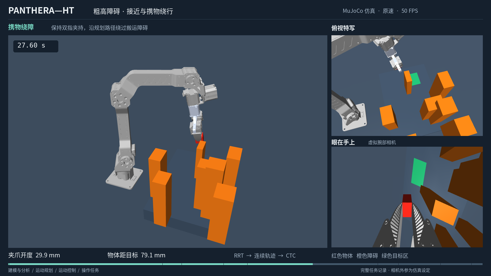
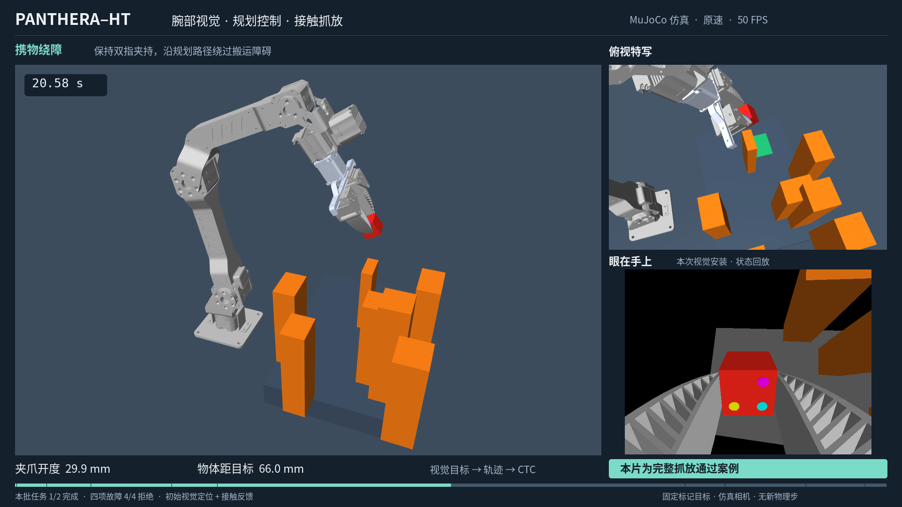
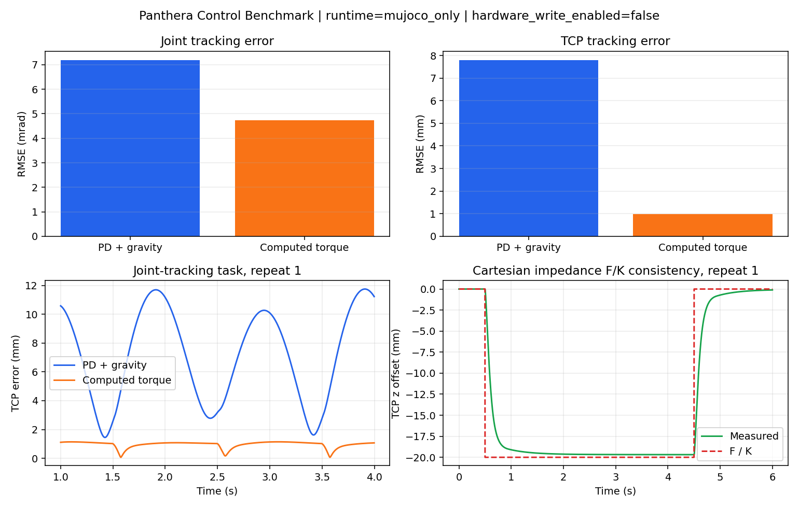

# Panthera-HT 机械臂控制与抓放仿真

以 Panthera 六轴机械臂和双指夹爪为对象，将**机器人建模、运动控制、运动规划与接触操作**连接成 MuJoCo 仿真闭环。项目用同条件控制对照和完整抓放任务，评价跟踪误差、柔顺响应、负载适应与避障执行。

[项目总结与实验报告](docs/project_summary.md) · [实验结果与媒体指纹](docs/results.json)

## 视频演示

| 七障碍环境中的完整抓放 | 腕部视觉驱动的抓放 |
|---|---|
|  |  |
| **[完整视频文件 · 42.98 秒](docs/media/panthera_tall_zh.mp4)** | **[完整视频文件 · 41.10 秒](docs/media/panthera_visual_execution_zh.mp4)** |
| 空手接近与携物搬运均经过绕障规划 | 仿真 RGB-D 定位后生成抓取与放置目标 |

两段视频均为中文、1080p、50 FPS，以原始仿真状态重建全臂、夹持特写和腕部视角，保留接近、夹持、搬运、释放与撤离全过程。腕部相机是仿真中的眼在手上视角。视觉视频选自声明批次中的成功案例，批次结果为 1/2，具体条件见报告。

## 代表性结果

| 实验 | 结果 | 条件 |
|---|---|---|
| PD+g 与计算力矩 CTC | 关节 RMSE **7.191 / 4.731 mrad** | 相同模型、参考轨迹和力矩限制 |
| 笛卡尔阻抗 | 静态 F/K 相对误差 **1.584%** | 固定姿态、方向与外力 |
| 负载质量自适应 | **36 次对照、216,000 个物理步**；62/124 g 负载下 RMSE 相对冻结估计降低 **96.22%–97.25%** | 单质量在线更新；已知质心与单位质量惯量 |
| 七障碍绕行抓放 | **两个预设规划种子均完成任务** | 固定布局，障碍高度 14–21 cm；整机、双指与携物碰撞检查 |
| 批量接触抓放 | **100/100** 完整任务 | 确定性 10×10 位置网格、名义模型、已知物体位姿 |

以上均为各自固定条件下的仿真结果。不同实验的指标分别评价，不表示真机精度、任意场景成功率或控制算法的普遍排名。

## 项目组成

| 板块 | 内容 |
|---|---|
| 机器人建模与分析 | Panthera 六轴与双指模型，工具中心点 TCP，正逆运动学、雅可比及动力学接口 |
| 运动控制 | PD+g、CTC、笛卡尔阻抗、负载质量自适应、模型误差与扰动观测实验 |
| 运动规划 | RRT-Connect、连续轨迹与时间分配，整机及携物碰撞查询 |
| 操作任务 | 接触抓放与任务监督，SpaceMouse TOOL 六自由度遥操，夹爪开度与同拍记录 |
| 感知 | 仿真腕部 RGB-D、同曝光时刻位姿、标记定位到抓取目标的坐标变换 |
| 学习实验 | 状态 BC、ACT、Diffusion Policy 与参考辅助 PPO，分别评价预测误差和物理任务结果 |

仿真物理步长为 2 ms。任务根据实际接触、抬升、放稳、脱指和撤离条件推进；展示视频使用传统规划与控制链，学习实验单独报告。

## 实现与来源

项目工作包括 Panthera 模型与坐标适配、控制器对照、碰撞约束下的轨迹执行、接触任务监督，以及实验数据和演示材料的整理。机器人抓取与操作实践提供任务组织与算法参考；具体机器人参数、控制接口和实验评价面向 Panthera 实现。

源码入口：[运动学](panthera/core/kinematics.py) · [动力学接口](panthera/core/robot.py) · [CTC](panthera/control/computed_torque.py) · [笛卡尔阻抗](panthera/control/impedance.py) · [动量观测器](panthera/control/momentum_observer.py) · [轨迹生成](panthera/planning/trajectory.py)。报告中的数值对应 [results.json](docs/results.json) 记录的实验版本与配置。

机器人几何资源来自 [HighTorque Robotics Panthera-HT ROS2](https://github.com/HighTorque-Robotics/Panthera-HT_ROS2)，物理求解使用 [MuJoCo](https://github.com/google-deepmind/mujoco)。项目代码许可见 [LICENSE](LICENSE)；第三方资源遵循各自的来源与许可声明。
