# Panthera-HT｜机械臂控制、规划与抓放

**从末端目标到关节力矩，从绕障路径到接触抓放。**

以 Panthera 六轴机械臂和双指夹爪为统一对象，连接机器人建模、运动控制、运动规划、操作、感知与学习。核心结果来自 MuJoCo 动力学与接触仿真，采用固定协议、原始状态记录和独立复算评价。

[机器人学](#robotics) · [控制](#control) · [规划](#planning) · [操作](#manipulation) · [感知](#perception) · [学习](#learning) · **[展示文档](docs/README.md)**

| 跟踪控制 | 柔顺响应 | 接触抓放 |
|:---|:---|:---|
| **7.191 → 4.731 mrad** | **1.584%** | **100 / 100 布局** |
| PD+g / CTC，六轴合并 RMSE | 阻抗静态 F/K 相对误差 | 固定 10×10 网格，已知物体位姿 |

## 先看完整任务

**七个粗高障碍中的完整抓放 · 43 秒**

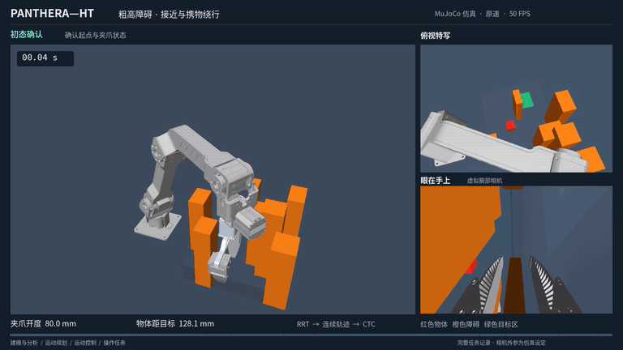

空手接近、双指夹持、携物绕行、放稳与撤离。障碍高度 **14–21 cm**；空手与携物直连均受阻，规划检查覆盖机械臂、双指和携物几何。视频为固定布局 seed 30，另一个预设种子也完成任务。

本页三段演示均为**完整、原速、循环 GIF**，直接预览，无需下载。768×432、20 FPS；原 MP4 为 1080p、50 FPS。画面来自保存的 MuJoCo 状态，腕部画面为仿真眼在手上视角。循环播放不增加实验次数。

## 01｜机器人学与动力学

统一 Panthera 的六轴顺序、工具中心点、双指状态和动力学接口，让规划器与控制器使用一致的机器人。

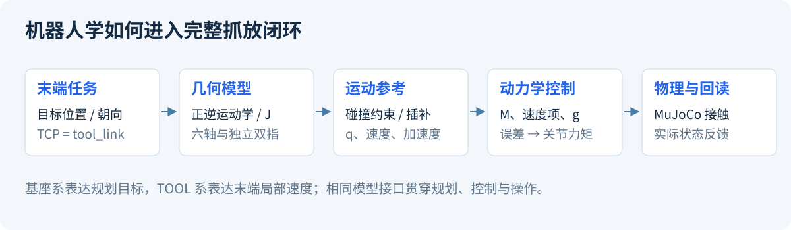

| 能力 | 在项目中的用途 |
|---|---|
| 正运动学 FK、数值逆运动学 IK | 关节角与 TCP 位姿互换；阻尼最小二乘处理奇异附近的数值问题 |
| 雅可比 J 与坐标变换 | TCP 线速度/角速度与关节速度映射；TOOL 输入按当前工具姿态转换 |
| 质量矩阵、速度项、重力项 | 为计算力矩、自适应及模型误差实验提供统一计算接口 |
| 机器人与夹爪模型绑定 | 六轴与夹爪独立；TCP 为 `tool_link = link6 + [0.165, 0, 0] m` |

**[阅读机器人学与动力学总结 →](docs/01_机器人学与动力学.md)**

## 02｜运动控制

### 轨迹跟踪与笛卡尔阻抗

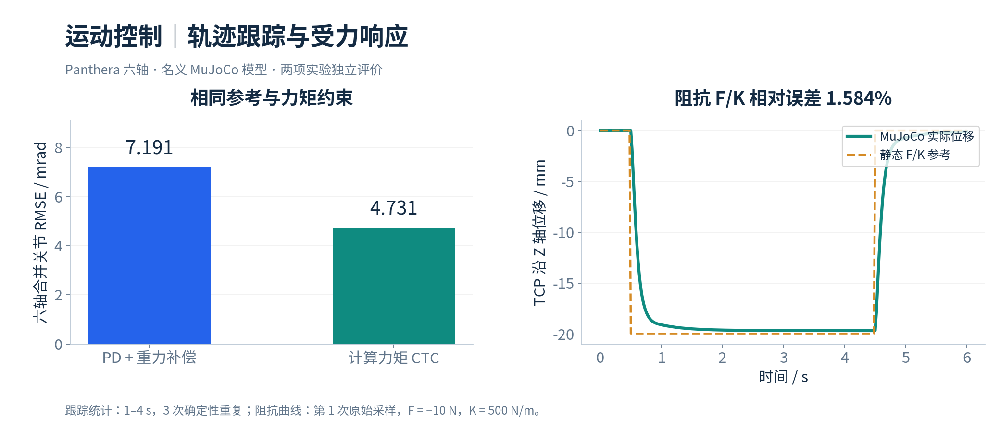

PD+g 与 CTC 使用相同模型、参考和力矩限制，各自采用声明增益。阻抗实验在 TCP 沿 Z 轴施加 −10 N，500 N/m 刚度对应理论 −20 mm 位移，实测 −19.683 mm。指标适用于这些固定条件。

### 负载质量自适应

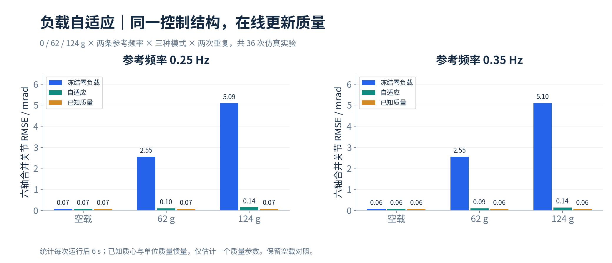

六轴参考动力学中在线更新一个负载质量参数；与冻结零负载、已知质量两组比较。**36 次、216,000 步**，62/124 g 条件下 RMSE 相对冻结估计降低 **96.22%–97.25%**。实验假设已知质心与单位质量惯量，空载对照也完整保留。

<strong>展开更多控制成果：扰动观测、参数辨识与夹持力反馈</strong>

**动量观测器与摩擦边界**：五个声明工况，扰动确认 106–114 ms，恢复到区间包含零 186–224 ms；每个工况晚期误报 0/1250。区间针对同带宽滤波外力矩，依赖声明摩擦边界。

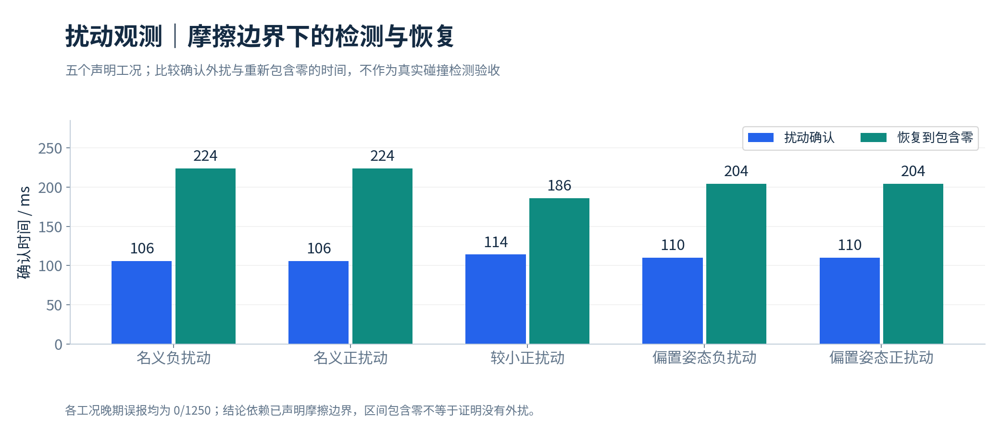

**辨识接入闭环**：同一冻结拟合结果使 PD+g 的误差下降 26.44%/29.50%，CTC 的误差增大 17.73%/15.32%。这项对照展示模型修正的适用性，完整保留两类结果。

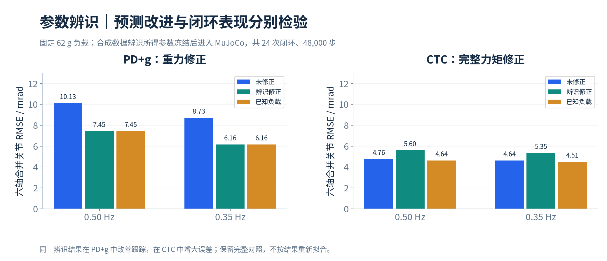

**夹持力反馈**：根据 MuJoCo 接触力调节开度，在固定桌面支撑、无测量噪声条件下比较 1 N / 2 N 稳态响应，机械臂由 CTC 保持。

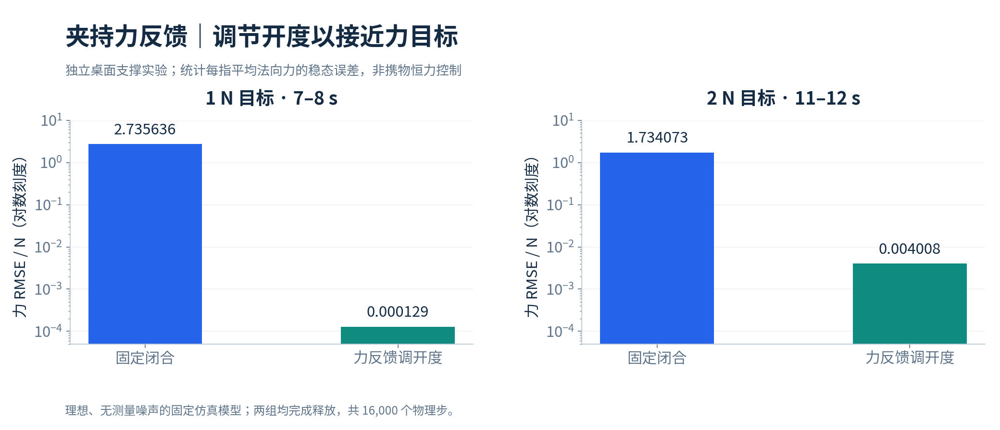

完整指标、增益、评价窗和模型误差对照见[控制专题](docs/02_运动控制与实验.md)。

### 二连杆控制基线：PID / 模型自适应 / RBF 神经网络

在同一台平面二连杆机械臂、同一条参考轨迹和同一初始误差下，实现并定量对比三种轨迹跟踪控制器：经典 PID、基于模型的自适应控制（MBAC，在线估计物理参数做前馈补偿）、RBF 神经网络自适应控制（不依赖动力学结构，用网络在线逼近）。三者的自适应律均按 Lyapunov 稳定性设计，以 RMSE、控制力矩范数和误差范数三项指标评价。MATLAB/Simulink 实现，`ode15s` 刚性求解。

这一组对照是本仓库六轴控制部分的方法基线：说明在"动力学结构已知、参数未知"与"结构也未知"两种前提下，应当选择哪一类控制器。

**[阅读二连杆对照的模型、稳定性推导与实验结果 →](matlab/two_link_arm_control/README.md)**

**[阅读控制方法、实验条件与完整结果 →](docs/02_运动控制与实验.md)**

## 03｜运动规划与连续轨迹

RRT-Connect 在六维关节空间寻找绕障路径；随后生成 **C² 连续关节曲线与五次时间律**，保留速度、加速度和 jerk 约束。曲线生成后重新检查碰撞，携物阶段考虑物体相对工具的位置。

七障碍固定布局的 seed 30/31 均完成抓放，共 **53,919 步**；端点被封堵的对照在运动前拒绝。图示 TCP 路径用于理解绕行，实际碰撞检查覆盖整机与携物。

**连续轨迹抓放 · 30.56 秒**

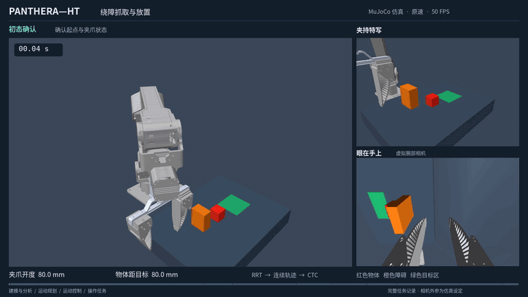

这段独立演示强调运动连续性：内部插值点不重复停车，保持原参考上限 0.25 rad/s、0.8 rad/s²、4 rad/s³；实际仿真 30.552 s，十阶段完成。抓取与释放仍保留必要的接触确认。

<strong>展开 S 曲线的参考与实际跟踪图</strong>

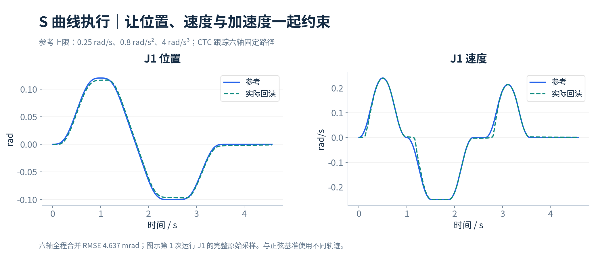

固定六轴 S 曲线路径的整体 RMSE 为 **4.637 mrad**；参考速度、加速度、jerk 与执行限幅检查通过。它与首页正弦跟踪实验的轨迹不同，数值分别评价。

**[阅读路径搜索、碰撞检查与时间参数化 →](docs/03_运动规划与避障.md)**

## 04｜接触操作与示教接口

任务完成由实际接触与物体状态判定：**双指承载 → 抬升 → 搬运 → 桌面支撑 → 脱指 → 撤离与放稳**。执行中的物体保持自由刚体，通过接触搬运。

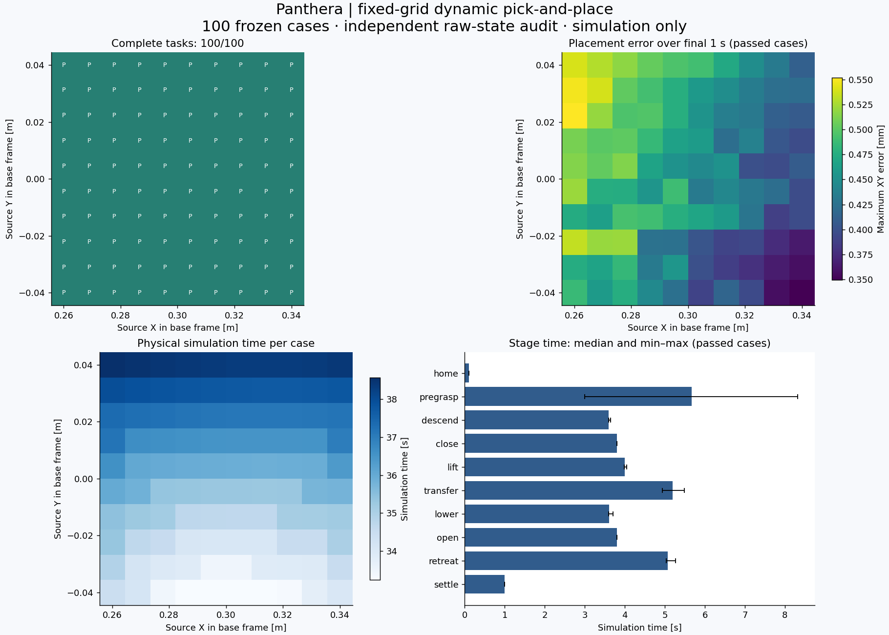

| 成果 | 实验或接口 |
|---|---|
| 批量完整任务 | 固定 10×10 布局 **100/100**，累计 **1,793,308 步** |
| 放置稳定性 | 各布局末 1 s 最大平面误差的范围 **0.349–0.552 mm**，名义仿真模型 |
| 接触求解对照 | 同一 500 Hz 控制，2/1/0.5 ms 物理步长下比较抓持漂移与释放 |
| 遥操与夹爪 | SpaceMouse TOOL 六自由度、软件离合、夹爪连续开度与独立回读 |
| 记录与数据 | 同拍记录关节、夹爪、物体、接触和控制输入；按仿真时钟导出 20 Hz 区间 |

**[阅读抓放判据、夹爪和数据记录总结 →](docs/04_接触操作与记录.md)**

## 05｜腕部视觉与抓取目标

**视觉驱动完整抓放 · 41.1 秒**

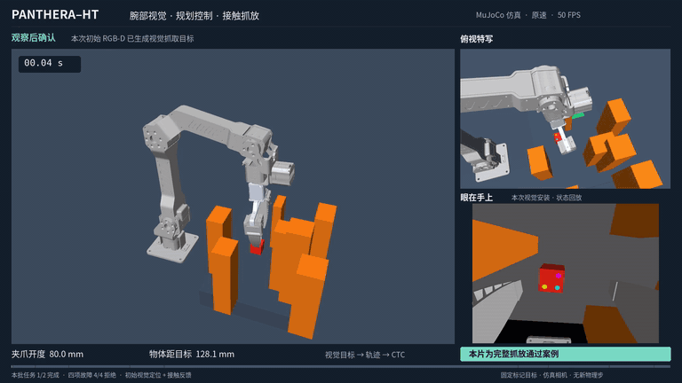

一次静止观察获取仿真 RGB-D，以已知三色标记几何估计物体位姿；通过同曝光时刻的机器人姿态变换到基座系，再进入 IK、RRT 与 CTC。演示来自声明批次中的成功案例：**两任务完成 1/2，四项输入故障均在运动前拒绝**。

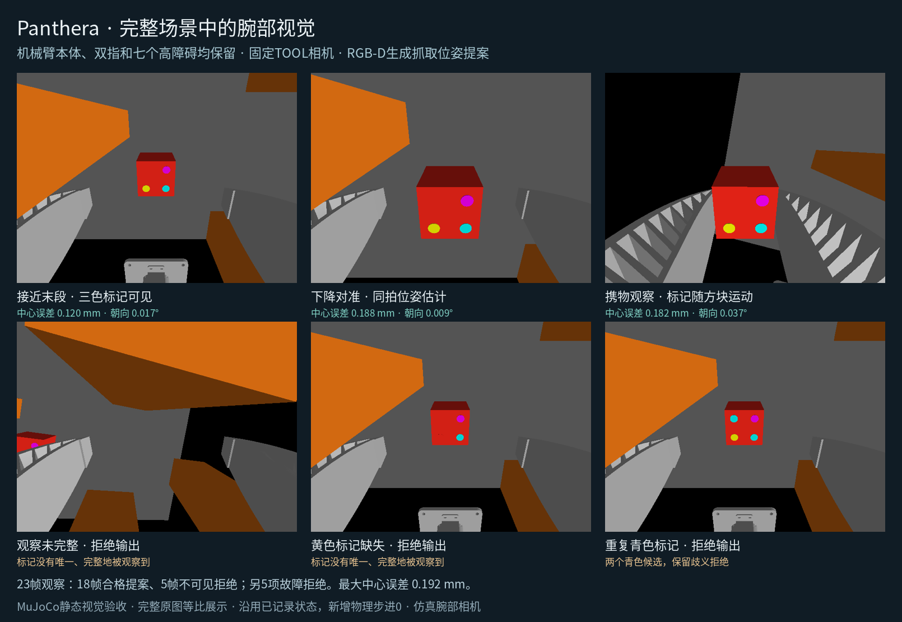

固定记录扫描 23 帧，18 帧产生合格提案、5 帧因不可见拒绝；已接受提案的最大中心误差 **0.192 mm**、朝向误差 **0.101°**。这组数据描述理想仿真图像与已知标记的定位表现，不与抓放任务次数混算。

**[阅读 RGB-D、坐标变换与视觉抓放总结 →](docs/05_感知与视觉抓放.md)**

## 06｜模仿学习与强化学习实验

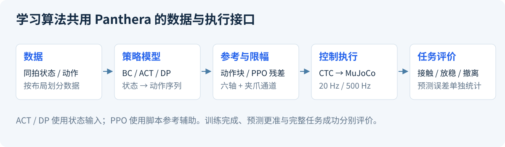

| 方法 | 已实现的 Panthera 适配与实验 |
|---|---|
| 状态 BC | 专家数据切片、按布局划分、归一化、动作原点与参考状态对照 |
| ACT | 45 维状态、CVAE/Transformer、8×7 动作块，固定 **3,600 次更新**及 MuJoCo 评价 |
| Diffusion Policy | 状态条件去噪、DDIM/EMA、动作块，固定 **3,600 次更新**及执行长度对照 |
| 参考辅助 PPO | 88 维观测、7 维残差、**8,192 次采样 / 550 次优化器更新**，训练与对照执行 |

学习实验分别评价预测和物理任务：ACT/DP 声明任务各 **0/2**；PPO 训练、未训练与零残差组均为 **2/2**，尚不能从这组结果归因出学习收益。本页成功视频来自传统规划与控制链。ACT/DP 当前使用状态输入，感知模块单独评价。

**[阅读模型、数据、训练与评价总结 →](docs/06_学习模型与评价.md)**

## 展示文档与成果清单

| 文档 | 主要内容 |
|---|---|
| [项目总报告](docs/project_summary.md) | 项目目标、完整链路、代表性实验、个人实现与复用关系 |
| [机器人学与动力学](docs/01_机器人学与动力学.md) | Panthera 模型、FK/IK、雅可比、坐标与动力学 |
| [运动控制与实验](docs/02_运动控制与实验.md) | 跟踪、阻抗、自适应、辨识、扰动与夹持力 |
| [运动规划与避障](docs/03_运动规划与避障.md) | RRT、整机/携物碰撞、连续轨迹与执行 |
| [接触操作与记录](docs/04_接触操作与记录.md) | 完整抓放、批量任务、遥操、夹爪、同拍数据 |
| [感知与视觉抓放](docs/05_感知与视觉抓放.md) | 仿真腕部 RGB-D、标记定位、视觉到任务 |
| [学习模型与评价](docs/06_学习模型与评价.md) | BC、ACT、DP、PPO 的适配与实际评价 |
| [图片、视频与实验成果目录](docs/07_成果目录.md) | 每项成果的用途、观看入口与对应实验 |
| [二连杆控制基线对照](matlab/two_link_arm_control/README.md) | PID / MBAC / RBF 神经网络自适应的同条件对比、Lyapunov 设计与 MATLAB 实现 |

`docs/` 放项目展示总结；`assets/` 放图片、动图和视频；`evidence/` 放数值摘要及采样曲线。[结果与媒体指纹](evidence/results.json)用于核对展示来源。

## 实现与来源

机器人抓取与操作实践提供任务组织和算法参考；本项目完成 Panthera 参数与坐标适配、控制器对照、碰撞约束下的执行、接触任务监督与数据评价。几何资源来自 [HighTorque Robotics Panthera-HT ROS2](https://github.com/HighTorque-Robotics/Panthera-HT_ROS2)，动力学与接触求解使用 [MuJoCo](https://github.com/google-deepmind/mujoco)。

已公开基础代码入口：[运动学](panthera/core/kinematics.py) · [动力学](panthera/core/robot.py) · [CTC](panthera/control/computed_torque.py) · [阻抗](panthera/control/impedance.py) · [动量观测器](panthera/control/momentum_observer.py) · [轨迹](panthera/planning/trajectory.py)。公开内容包括基础源码和经整理的项目总结；结果摘要不包含全部逐步实验数据。许可见 [LICENSE](LICENSE)。
