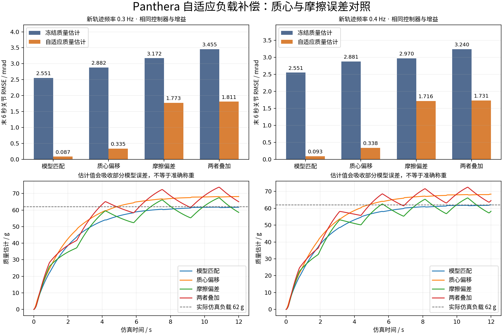

# 运动控制与实验

[首页图表](../README.md#control) · [展示目录](README.md) · [结果摘要](../evidence/results.json)

## 控制器怎样接入执行

规划器提供关节位置、速度和加速度参考；控制器读取实际 q、q̇，计算六轴力矩；MuJoCo 执行并回读。重力项保持在相关控制律中。夹爪独立控制，遥操使用 PD+g，自主抓放使用其声明的 CTC 配置。

| 方法 | 控制量与作用 |
|---|---|
| PD+g | `τ = Kp(q_ref−q) + Kd(q̇_ref−q̇) + g(q)`，反馈纠偏并补偿重力 |
| CTC | `a = q̈_ref + Kv(q̇_ref−q̇) + Kp(q_ref−q)`；`τ = M(q)a + h(q,q̇) + g(q)` |
| 笛卡尔阻抗 | TCP 误差与速度产生弹簧/阻尼作用，经雅可比转置映射到关节并补偿重力 |
| 负载质量自适应 | 六轴参考动力学加入质量线性项，对一个质量参数做带投影约束的在线更新 |
| 动量观测器 | 利用模型、速度和输入力矩构造外作用残差；摩擦不确定性用声明区间处理 |

CTC 与 PD+g 的 Kp/Kd 含义及量纲并不相同；比较使用同参考和力矩限制，各自采用声明增益。

## 轨迹跟踪与阻抗响应

初态 `[0, 0.7, 0.7, −0.1, 0, 0] rad`，六轴正弦幅度 `[0.3, 0.2, 0.3, 0.2, 0.3, 0.3] rad`，频率 0.5 Hz。每次 4 s，前 1 s 平滑启动，统计 `[1,4) s`。PD+g 为 kp=20、kd=8；CTC 自然频率 30 rad/s、阻尼比 1。

两者力矩限值均为 `[10,20,20,10,5,5] N·m`。三次确定性重复检查再现性，不作为三个独立随机样本。

| 指标 | PD+g | CTC |
|---|---:|---:|
| 六轴合并关节 RMSE | 7.191 mrad | 4.731 mrad |
| TCP 位置 RMSE | 7.797 mm | 0.990 mm |
| 合并力矩 RMS | 2.44335 N·m | 2.44422 N·m |
| 最大绝对力矩 | 6.34521 N·m | 6.36162 N·m |

阻抗在 TCP 沿基座 Z 轴施加 −10 N，平移刚度 500 N/m；理论静态偏移 −20 mm，稳态实测 −19.683 mm，相对误差 **1.584%**。外力作用在 `[0.5,4.5) s`，稳态窗口 `[3.5,4.5) s`。这是一个姿态与受力方向的柔顺响应。

## 负载自适应与模型误差

质量条件 0、62、124 g，频率 0.25、0.35 Hz；冻结零负载、自适应、已知质量三组均沿用相同参考和反馈结构。每次 12 s，统计后 6 s，两次确定性重复，共 **36 次、216,000 步**。

| 负载 / 频率 | 冻结零负载 / mrad | 自适应 / mrad | 已知质量 / mrad |
|---|---:|---:|---:|
| 0 g / 0.25 Hz | 0.07134 | 0.07128 | 0.07134 |
| 0 g / 0.35 Hz | 0.06420 | 0.06433 | 0.06420 |
| 62 g / 0.25 Hz | 2.54669 | 0.09618 | 0.07148 |
| 62 g / 0.35 Hz | 2.55095 | 0.08953 | 0.06415 |
| 124 g / 0.25 Hz | 5.08748 | 0.14450 | 0.07164 |
| 124 g / 0.35 Hz | 5.09862 | 0.14000 | 0.06409 |

有载条件相对冻结零负载估计降低 96.22%–97.25%。该方法知道负载质心与单位质量惯量，仅估计质量，不是全动力学参数在线辨识。

进一步冻结控制器与增益，在 62 g 负载下比较名义、质心偏差、摩擦偏差及两者共同偏差，频率 0.3/0.4 Hz，共 32 次、192,000 步。质心偏差下 RMSE 降低 88.28%–88.38%，摩擦偏差下降低 42.23%–44.11%；估计质量可能吸收其他误差。

## 参数辨识进入控制闭环

先用合成数据拟合动力学基参数，再冻结含噪结果，分别修正 PD+g 的重力项和 CTC 的完整力矩项。固定 62 g 负载，24 次、48,000 步，无本批次重新拟合。

PD+g 在 0.50/0.35 Hz 的误差降低 **26.44%/29.50%**；CTC 对应增大 **17.73%/15.32%**。相同模型修正的作用取决于它在控制律中的使用方式；离线预测更准不能代替闭环比较。已保存记录显示部分反馈加速度超出训练激励范围，这支持进一步检查模型适用范围，但不是唯一因果证明。

## 扰动观测与摩擦边界

项目在 J3 注入已知力矩，评价动量残差。原点估计在名义条件下稳态 RMSE 为 0.141 N·m，但卸载晚期仍误报；后续依据声明摩擦边界、粘性项及冻结校准构造条件区间。

五个已测工况中，同带宽滤波外力矩真值的覆盖均为 4000/4000，晚期误报均为 0/1250；扰动确认 106–114 ms，恢复到包含零 186–224 ms。区间在 J3 约宽 0.4 N·m，小扰动可能与摩擦混淆。把声明摩擦边界减半时覆盖降至 26.775%，表明边界假设直接影响结论。

## 夹持力反馈

保持机械臂与桌面支撑物体，根据双指接触法向力调节夹爪开度；与固定闭合比较。每指平均法向力的稳态 RMSE 为：

| 目标与窗口 | 固定闭合 | 力反馈调节 |
|---|---:|---:|
| 1 N，7–8 s | 2.735636 N | 0.000129 N |
| 2 N，11–12 s | 1.734073 N | 0.004008 N |

两组共 16,000 步，均完成释放。该结果来自固定、无测量噪声的支撑模型和指定稳态窗，不代表真机力精度或搬运中的恒力控制。

## 验证方式与来源

使用原始 CSV/NPZ/逐拍状态重算指标，并检查参考、时间、力矩、模型和数据来源。自适应及其模型误差实验另做保存力矩的 MuJoCo 独立重放：只初始化一次，再用原力矩积分产生状态；这项复核不增加算法性能试验次数。

数值、报告标识和摘要指纹见[结果文件](../evidence/results.json)，控制曲线见[采样数据](../evidence/control_curves.json)。[原控制报告四联图](../assets/images/control_comparison.png)补充 TCP 三维位置 RMSE 和误差随时间的变化；[原自适应报告四联图](../assets/images/payload_adaptive_comparison.png)补充估计质量与 J2 误差随时间的变化。[CTC](../panthera/control/computed_torque.py)、[阻抗](../panthera/control/impedance.py)及[动量观测器](../panthera/control/momentum_observer.py)提供已公开基础源码入口。
