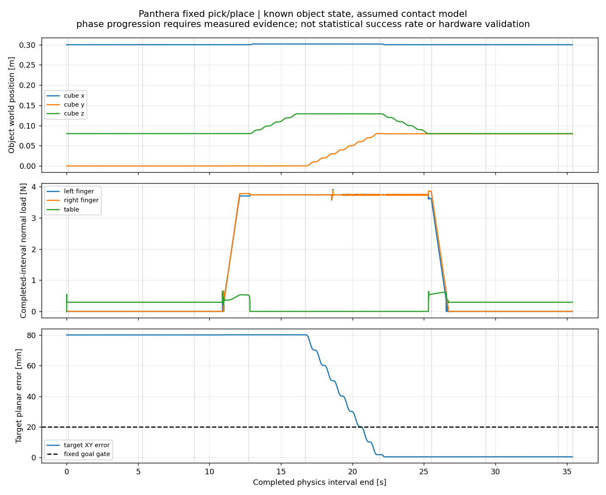
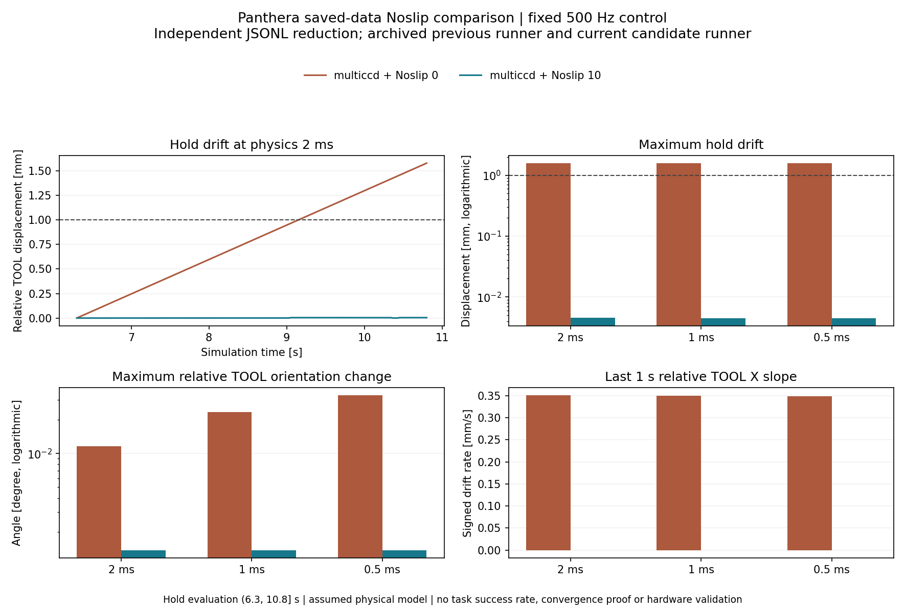

# 接触操作与记录

[首页成果](../README.md#manipulation) · [展示目录](README.md) · [夹持力实验](02_运动控制与实验.md#夹持力反馈)

## 完整抓放的判定

任务按初态、预抓取、下降、闭合、抬升、搬运、放下、张开、撤离、稳定十阶段组织。阶段推进依赖实际回读，而非只按时间播放轨迹。

| 阶段 | 检查的实际量 |
|---|---|
| 闭合 | 双指均有正法向承载，达到持续接触条件 |
| 抬升 | 物体达到高度要求，保持承载，离开桌面支撑 |
| 搬运 | 物体随工具运动，无失载或意外接触 |
| 放置、释放 | 物体得到桌面支撑，夹指脱离 |
| 撤离、稳定 | 目标位置、线/角速度、支撑、无指接触与 TCP 撤离距离同时满足 |

物体在 MuJoCo 中是自由刚体；控制指令作用于六轴和夹爪，物体运动通过接触求解产生。原始数据保存关节、物体、接触和任务阶段，便于把“手臂到了”与“任务完成了”分开。

## 100 布局批量接触抓放

在固定名义模型、已知物体位姿和确定性 10×10 位置网格下，每布局执行一次完整任务，**100/100**，累计 **1,793,308 个物理步**。每例末 1 s 最大平面误差的最小/中位/最大值为 **0.349 / 0.454 / 0.552 mm**。

该批次用于固定协议下的接触任务验证；高障碍场景、视觉任务和学习任务有各自协议，不计入这一百例。

## 接触求解与抓持稳定性

使用同一 500 Hz 控制，比较 2、1、0.5 ms 物理步长及 MuJoCo Noslip 0/10 设置。固定保持评价窗和 1 mm 漂移门，不随结果改变标准。

| 物理步长 | Noslip 0 最大相对位移 | Noslip 10 最大相对位移 |
|---|---:|---:|
| 2 ms | 1.579343 mm | 0.004504 mm |
| 1 ms | 1.572905 mm | 0.004495 mm |
| 0.5 ms | 1.571310 mm | 0.004484 mm |

这项实验说明假定接触模型下的数值抓持表现和步长一致性。Noslip 是 MuJoCo 求解器功能，非本项目原创控制器；微米量级仿真位移不作为实物稳定精度。

## SpaceMouse、开度与力反馈

SpaceMouse 采用 `ros_rep103` 规范输入、正常 `TOOL/full_6dof` 模式。左键短按切换软件离合；右键上升沿切换仿真开合。连续开度可独立设置，保守夹爪电机角度范围 0–1.6 rad。夹爪状态独立于机械臂六轴。

TOOL 六维输入先按当前工具姿态变成基座系速度，通过雅可比产生关节参考，再由 PD+g 执行。平移和旋转允许同时输入。输入故障时进入 PD+g 保持；不将六轴力矩清零代替保持。

接触力反馈是独立仿真实验：力误差调节开度，机械臂保持，比较 1 N/2 N 静态支撑条件。详见[控制专题](02_运动控制与实验.md#夹持力反馈)。

## 同拍记录与学习数据接口

每个仿真事务记录输入来源、参考、实际力矩、步进后关节/双指/物体状态和接触汇总。按 20 Hz 导出时，每个 50 ms 区间保留其全部 25 条 500 Hz 源事务，而非假定某一个动作恒定作用整个区间。

记录具有模型绑定、时序和连续性检查；任务标签由监督条件产生。格式完整、脚本专家轨迹和完整人工抓取示教是不同概念；本项目展示的训练数据主要来自脚本专家及仿真纠正片段。

成果摘要和图像指纹见[结果文件](../evidence/results.json)。真实 SpaceMouse 方向验收、真机夹爪和真实力精度独立于这些仿真任务成绩。
