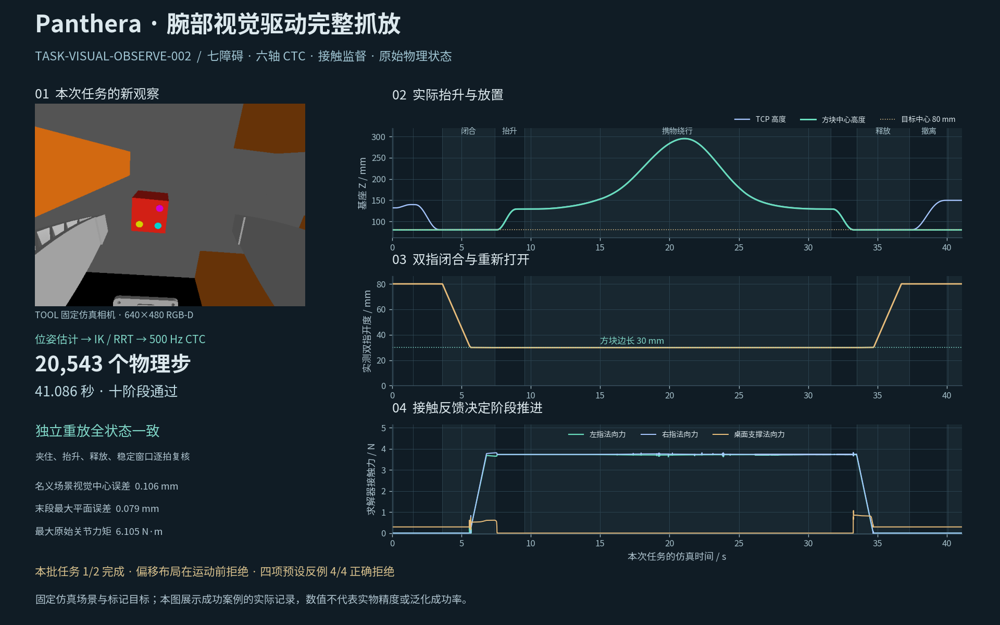

# 感知与视觉抓放

[首页视觉视频](../README.md#perception) · [展示目录](README.md) · [规划专题](03_运动规划与避障.md)

## 仿真腕部 RGB-D

虚拟相机与 TOOL 刚性连接，随末端位姿变化。完整场景保留 Panthera、本体双指、桌面与七个障碍的遮挡。实验安装位置为 TOOL 下 `[-75,0,45] mm`，图像 640×480、垂直视场角 70°。这些是演示相机设置，不是 D405 标定参数。

视觉输入包含完整 RGB、米制深度、相机内参，以及与曝光时刻一致的机器人状态。颜色/几何预测器不读取物体真值位置或分割 ID。

## 从像素到抓取目标

1. 从 RGB 中筛选青、品红、黄色标记，检查唯一性和几何关系。
2. 根据像素、深度和相机内参反投影为相机系三维点。
3. 结合已知 30 mm 方块和三色标记几何，拟合物体中心与朝向。
4. 用同拍 `T_base_tool` 和固定 `T_tool_camera` 组成 `T_base_camera`，将估计变换到基座系。
5. 保留物体朝向生成抓取/预抓取 TOOL 目标，经 IK、碰撞与 RRT 检查后进入 CTC 执行。

## 视觉定位结果

固定十阶段记录预选 23 帧，18 帧生成合格提案，5 帧因标记不可见拒绝；已接受提案最大中心误差 **0.192 mm**、最大朝向误差 **0.101°**。抓取接触前有 5 帧产生提案。

缺标记、重复颜色、无效深度、2 ms 错拍和 20 mm 外参偏差共五项输入反例均按预期拒绝。23 帧是观察覆盖，非 23 次完整抓放。

## 视觉驱动的完整抓放

一次静止观察产生目标后进入十阶段规划与执行。声明的两个任务中，名义布局完成 **20,543 步、41.086 s**；偏移布局在预抓取端点碰撞检查处拒绝。结果为 **1/2**，不是两个场景全部成功。

缺标记、错误曝光时刻、偏差外参和放置点封堵四项故障均在运动前拒绝，结果 **4/4**。视觉输入资格、几何可行性和完整任务完成分别计数。

## 与课程实践和学习模块的关系

该链路结合“位姿估计 → 抓取目标 → 规划 → 执行”的实践思路，以 Panthera 坐标和模型落地。当前定位方法是已知几何的颜色标记 RGB-D 估计；它不构成 PoseCNN 的训练或分割算法复现。

ACT/DP 的当前实验使用状态向量，没有图像编码器。视觉估计和策略学习分别评价。视频是仿真相机的一次观察后执行，不代表真实 D405 开流、手眼标定或连续视觉伺服。

来源、位姿与任务摘要见[结果文件](../evidence/results.json)。
