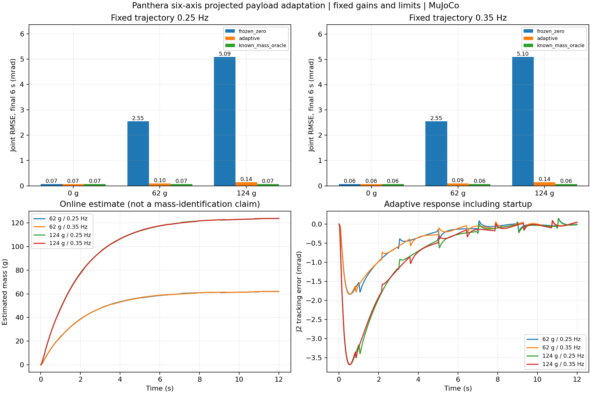
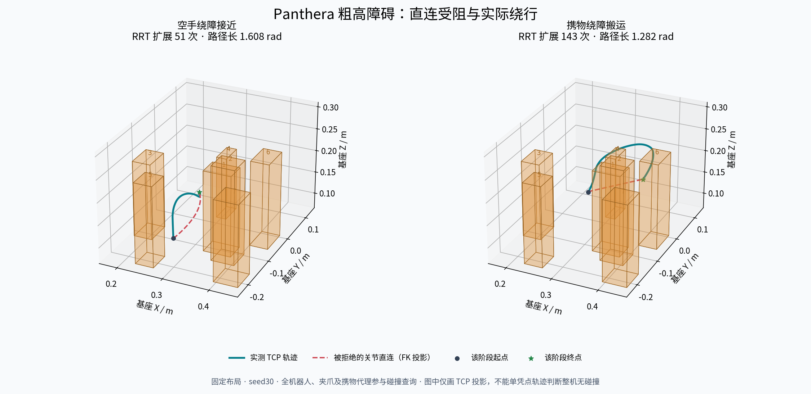

# Panthera-HT 项目总结与实验报告

[项目首页与视频](../README.md) · [实验结果与媒体指纹](results.json)

项目围绕同一台 Panthera 六轴机械臂，研究从末端目标到动力学执行，再到物体接触与任务完成的完整链路。实验分别回答三个问题：参考轨迹能否准确跟踪，规划路径能否安全执行，以及物体是否真正抓住并放稳。

## 1. 机器人建模与分析

机械臂关节向量包含六个旋转关节；双指夹爪使用独立状态与控制接口。控制点为 `TCP = tool_link`，相对 `link6` 的位置为 `[0.165, 0, 0] m`。TOOL 坐标轴随末端姿态转动，工具 X 轴沿工具前向。

运动学把关节角转换为 TCP 位姿；逆运动学和雅可比把末端目标或速度转换为关节参考。动力学接口提供质量矩阵、速度相关项和重力项，为控制器计算关节力矩。角度使用 rad、距离使用 m，物理步长为 0.002 s。

| 输入 | 处理 | 输出 |
|---|---|---|
| TCP 目标、障碍几何 | 逆运动学、关节空间路径搜索 | 可行路径 |
| 路径、速度与加速度约束 | 连续轨迹和时间分配 | 关节位置、速度、加速度参考 |
| 参考与实际关节状态 | PD+g / CTC 等控制律 | 六轴力矩 |
| 力矩、夹爪指令 | MuJoCo 动力学与接触求解 | 关节、夹爪、物体及接触状态 |
| 实际回读状态 | 任务监督与记录 | 阶段切换、完成判断与实验数据 |

## 2. 运动控制

### 关节跟踪与笛卡尔阻抗

PD+g 由位置和速度误差产生反馈力矩，再补偿重力；CTC 使用模型计算运动所需的前馈力矩，并通过反馈修正跟踪偏差。基准使用相同模型、参考轨迹和力矩限制，控制器采用各自声明的增益。

| 指标 | PD+g | CTC |
|---|---:|---:|
| 六轴合并关节 RMSE | 7.191 mrad | 4.731 mrad |

参考频率 0.5 Hz，运行 4 s，统计窗口为 `[1, 4) s`。三次运行检查确定性重复性，不作为三个独立统计样本。两组平均 RMS 力矩相差 0.036%，峰值力矩相差 0.258%。初态、幅度及控制增益列于 [结果摘要](results.json)。

笛卡尔阻抗实验在 TCP 施加 −10 N 的 Z 向力，平移刚度为 500 N/m。理论静态偏移为 −20 mm，测量为 −19.683 mm，F/K 相对误差 **1.584%**。该实验评价柔顺响应，与关节跟踪 RMSE 分开统计。

### 负载质量自适应

在六轴动力学中对**一个末端负载质量参数**在线更新。负载质心和单位质量惯量已知，质量估计使用投影约束。冻结零负载估计、自适应和已知质量对照沿用相同反馈与参考。

| 负载 / 频率 | 冻结零负载估计 | 自适应 | 已知质量对照 |
|---|---:|---:|---:|
| 62 g / 0.25 Hz | 2.547 mrad | 0.096 mrad | 0.071 mrad |
| 62 g / 0.35 Hz | 2.551 mrad | 0.090 mrad | 0.064 mrad |
| 124 g / 0.25 Hz | 5.087 mrad | 0.144 mrad | 0.072 mrad |
| 124 g / 0.35 Hz | 5.099 mrad | 0.140 mrad | 0.064 mrad |

每次运行 12 s，统计后 6 s；包含空载条件与两次确定性重复，共 **36 次、216,000 个物理步**。表中负载条件下，RMSE 相对冻结估计下降 **96.22%–97.25%**。这验证声明模型下的质量自适应效果，评价范围为单质量参数。

## 3. 运动规划

固定桌面放置七个 **14–21 cm** 高障碍。空手接近和携物搬运的直连均受阻，RRT-Connect 在六维关节空间搜索路径，再生成连续运动参考。碰撞查询包含整机、双指与携带物体，每个障碍面外扩 6 mm；仿真使用 CTC 执行。

参考采用分段三次关节曲线与统一时间分配，使段间的位置、速度和加速度连续。曲线生成后再次检查碰撞，避免把离散路径可行直接当成连续轨迹可行。

| 预设种子 | 物理步数 | 完整任务仿真时间 | 末 1 s 最大物体平面误差 |
|---|---:|---:|---:|
| 30 | 21,481 | 42.962 s | 0.166 mm |
| 31 | 32,438 | 64.876 s | 0.623 mm |

每阶段最多 3 次规划尝试，每次最多 2,400 次扩展；不通过曲线碰撞检查时，在同一预算内重新规划。目标封堵案例在端点检查时拒绝，物理执行为 0 步。两个种子共享固定布局，随机性来自规划采样。

两组记录合计 **53,919 个物理步**，逐步重建的整机、双指与携物状态均通过相应障碍检查。离散路径检查与保存状态上的复核不构成任意连续运动的数学安全证明。

## 4. 操作任务

完整抓放由接近、闭合、抬升、搬运、放下、释放和撤离等阶段组成。阶段推进依据实际回读，分别检查双指接触、抬升高度、物体到达目标、桌面支撑、脱指和稳定条件。

在名义 MuJoCo 模型与已知物体位姿下，对确定性 **10×10 位置网格**逐例执行完整任务，结果为 **100/100**；每个布局运行一次，累计 **1,793,308 个物理步**。该批次评价固定协议下的接触任务表现。

交互操作链包括 SpaceMouse TOOL 六自由度遥操、夹爪开度指令，以及关节、夹爪、物体和接触状态的同拍记录。遥操由当前 TOOL 姿态转换末端速度，通过雅可比生成关节参考，再由 PD+g 执行；自主抓放使用独立的任务规划与 CTC 链路。

[七障碍抓放视频](media/panthera_tall_zh.mp4)对应 seed30 的原始状态，2,149 帧覆盖一次完整任务；画面包含全臂、夹持特写和仿真腕部视角。

## 5. 感知

视觉任务使用一次静止观察获得的**仿真 RGB-D**、同曝光时刻的机器人位姿和已知标记尺寸。先将图像与深度中的目标变换到机器人基坐标系，再通过逆运动学、RRT 和 CTC 完成抓放。

两个声明任务中，名义布局完成 **20,543 个物理步**；另一布局将物体 X/Y 各偏移 3 mm，因预抓取端点碰撞而拒绝，批次结果为 **1/2**。缺标记、错误曝光时刻、偏差外参及放置点封堵四项故障均在运动前拒绝。

[腕部视觉抓放视频](media/panthera_visual_execution_zh.mp4)展示名义布局的成功过程。腕部相机与工具刚性连接，使用仿真外参；本实验属于仿真图像驱动的单次观察与执行，不包含真实 D405 或连续视觉伺服的实物结论。

## 6. 学习实验

学习部分实现状态 BC、ACT、Diffusion Policy 的数据接口、模型训练与 MuJoCo 物理评价，并建立参考辅助 PPO 环境。评价区分动作预测误差与完整任务完成情况。

| 方法 | 输入与输出 | 声明任务的结果 |
|---|---|---|
| ACT / Diffusion Policy | 状态观测到动作序列 | 各自两任务的完整抓放为 0/2 |
| 参考辅助 PPO | 状态与传统参考到控制残差 | 训练策略、未训练策略、零残差参考均为 2/2 |

PPO 的上述结果说明参考辅助任务能够执行，不能据此归因出学习收益。首页的成功视频来自传统规划与控制链。

## 7. 数据与来源

[results.json](results.json)汇总实验配置、结果、原始报告标识、SHA-256 和媒体指纹。数字对应保存报告中的模型和源码版本；记录标识用于核对来源。这里提供的是项目结果摘要，原始逐步数组未包含在摘要内。

Panthera 的机器人几何来自 [HighTorque Robotics](https://github.com/HighTorque-Robotics/Panthera-HT_ROS2)，动力学与接触由 [MuJoCo](https://github.com/google-deepmind/mujoco)求解。机器人抓取与操作实践提供任务组织及算法参考；本项目完成 Panthera 参数、坐标和控制接口适配，设计控制对照、接触任务与对应评价。

ACT、Diffusion Policy 和 PPO 属于已有方法；项目工作集中在 Panthera 数据和环境适配、训练与评价。所有结果均为仿真或离线实验，硬件写入关闭。
