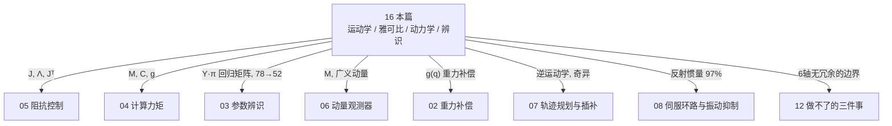

# 16 机器人学地基：运动学、雅可比、动力学与参数辨识

> 这一篇是**地基**。前面每一篇讲的控制器，底下都踩着这一篇的东西：
> 阻抗控制要用雅可比 $J$（[05](05_阻抗控制.md)），计算力矩要用 $M,C,g$（[04](04_计算力矩.md)），
> 参数辨识要用回归矩阵 $Y$（[03](03_参数辨识.md)），重力补偿要用重力项 $g(q)$（[02](02_重力补偿.md)），
> 轨迹规划要用逆运动学（[07](07_轨迹规划与插补.md)）。
>
> 之前它们散落在各篇里"用到了顺口一提"。这一篇把它们**集中讲一遍**，
> 从零开始，每个概念都配 Panthera 的**实测数字**。
>
> 数字标可信度：`实测` = 本仓库跑出来的｜`官方` = 客服/文档确认的｜
> `真值` = 仿真里已知的｜`理论` = 教科书推的｜`占位` = 待辨识回填。

---

## 【一分钟速查】

| 符号 | 中文名（念作） | 是什么 | 形状（Panthera） | 在哪用 |
|---|---|---|---|---|
| $q$ | 关节角（q） | 6 个电机各转了多少弧度 | 6 | 到处 |
| $p, R$ | 末端位姿（p、R） | TCP 在哪、朝哪 | $3 + 3\times 3$ | 全部 |
| $J(q)$ | 雅可比（Jacobian） | 关节速度 → 末端速度的"换挡箱" | **$6\times 6$** | 阻抗、伺服、逆解 |
| $w(q)$ | 可操作度（w） | 这个姿势"灵不灵活" | 标量 | 避奇异 |
| $\kappa(q)$ | 条件数（kappa） | 各方向灵活度差多少倍 | 标量 | 避奇异 |
| $M(q)$ | 质量矩阵（M） | "推得动推不动" | **$6\times 6$** | 计算力矩、MPC |
| $C(q,\dot q)\dot q$ | 科氏/离心项（C q dot） | 转起来才有的"甩劲" | 6 | 计算力矩 |
| $g(q)$ | 重力力矩（g） | 不动也得使的劲 | 6 | 重力补偿、示教 |
| $\Lambda(q)$ | 任务空间惯量（Lambda） | 从手上感觉到的等效质量 | $6\times 6$ | 阻抗控制 |
| $Y(q,\dot q,\ddot q)$ | 回归矩阵（Y） | 把动力学写成"矩阵 $\times$ 参数" | **$6\times 78$** | 辨识 |
| $\pi$ | 参数向量（pai） | **78** 个待辨识的物理参数 | 78 | 辨识 |

⭐ 三个和 Panda 最不一样的地方，先记住：

| | Panda（源讲义） | **Panthera** |
|---|---|---|
| 自由度 | 7 轴 | **6 轴** |
| 雅可比形状 | $6\times 7$（**长方**，必须用伪逆） | **$6\times 6$（方阵**，可以直接求逆） |
| 零空间 | 1 维（能"肘动手不动"） | ⛔ **0 维**（`实测` 秩=0，一个冗余都没有） |
| 总质量 | ~18 kg | **3.4 kg**（`实测` 3.399） |
| 参数总数 / 基参数 | 91 / 62 | **78 / 52**（`实测`） |

---

## 目录

- [零、10 分钟入口（完全零基础从这儿开始）](#零10-分钟入口完全零基础从这儿开始)
- [一、这一篇要回答的三个问题](#一这一篇要回答的三个问题)
- [二、正运动学：关节角 → TCP 在哪](#二正运动学关节角--tcp-在哪)
- [三、雅可比 $J$：机器人的"换挡箱"](#三雅可比-j机器人的换挡箱)
- [四、奇异位形与可操作度：为什么机械臂会突然"发疯"](#四奇异位形与可操作度为什么机械臂会突然发疯)
- [五、⚠️ 冗余与零空间：为什么 Panthera 一个都没有](#五-冗余与零空间为什么-panthera-一个都没有)
- [六、逆运动学：手要去那儿，关节该转多少](#六逆运动学手要去那儿关节该转多少)
- [七、动力学：$M$、$C$、$g$ 到底各是什么](#七动力学mcg-到底各是什么)
- [八、⚠️⚠️ TCP 有四个定义：一个"测试全过不等于正确"的活教材](#八-tcp-有四个定义一个测试全过不等于正确的活教材)
- [九、逆动力学与回归矩阵：把物理写成"矩阵乘参数"](#九逆动力学与回归矩阵把物理写成矩阵乘参数)
- [十、参数辨识：怎么把 $\pi$ 量出来](#十参数辨识怎么把-pi-量出来)
- [十一、边界（必须诚实的部分）](#十一边界必须诚实的部分)
- [十二、面试怎么讲](#十二面试怎么讲)
- [十三、动手：自己把这些数跑出来](#十三动手自己把这些数跑出来)

### 📖 这一篇很长，别从头啃——按这个顺序读

| 遍数 | 读哪几节 | 读完能干什么 |
|---|---|---|
| 第一遍（约 25 分钟） | **二 → 三 → 四 → 七** | 建立 80% 的直觉：手在哪、怎么换算、什么时候会发疯、力矩由什么组成 |
| 第二遍（约 25 分钟） | **五 → 六 → 九 → 十** | 补上"为什么没有冗余"、逆解、回归矩阵、辨识 |
| 面试前 | **十二** | 分层递进的讲法，带全部实测数字 |
| 想自己复现 | **十三** | 自己把每个数跑出来 |

🆕 **完全零基础、看到矩阵就懵？** 先读下面的 **§零 10 分钟入口**——
不用一个矩阵，把整篇在讲什么先说清楚，再回来按上表走。

⭐ 如果只有 10 分钟：读 **§三**（雅可比两个方向）和 **§7.2**（四项占比那张表）。
这两个最容易在面试里被追问，也最容易讲出彩。

🚫 **哪些可以先跳过**（第一遍完全不影响理解）：

| 可以跳过 | 什么时候再回来 |
|---|---|
| §4.7（工程对策清单） | 真要写避奇异逻辑的时候 |
| §五（冗余与零空间） | ⭐ 对 Panthera 结论就一句：**没有**。可以秒读 |
| §6.2 的实现细节 | 自己动手写逆解器的时候 |
| §9.4（$\pi$ 的 10 个惯性参数怎么排） | 真要做辨识、要看 $\hat\pi$ 输出的时候 |
| §十一（边界） | 面试前一定要读，学的时候可以跳 |

---

## 零、10 分钟入口（完全零基础从这儿开始）

> 上面那张符号表现在看不懂是正常的。这一节**不用一个矩阵**，
> 先把整篇在讲什么说清楚。读完再回头看符号表，会好很多。

### 0.1 整个机器人学，就在回答三个问题

举起你自己的胳膊，慢慢做一遍「伸手去拿杯子」，边做边想：

| 问题 | 你的身体在干什么 | 机器人学管这个叫 | 本篇哪一节 |
|---|---|---|---|
| **① 我的手现在在哪？** | 肩、肘、腕转了多少 ⇒ 手就在某个位置 | **正运动学（FK）** | §二 |
| **② 我想让手往前 1 cm，各个关节该怎么转？** | 大脑自动换算 | **雅可比 $J$ / 逆运动学（IK）** | §三、§六 |
| **③ 要动起来，肌肉得使多大劲？** | 越快越费劲、举着不动也累 | **动力学（$M$、$C$、$g$）** | §七 |

⭐ **这三个问题从易到难**，而且**后一个用到前一个**。全篇就是围着它们展开的。

### 0.2 正运动学：一张「查表」

**已知每个关节转了多少度，算出手在哪。**

* 就像折叠尺：每一节转多少是知道的，**一节一节接下去**，最后那头在哪就算得出来
* ⭐ 它**只有唯一答案**，而且很好算——关节角一定，手的位置就定了

> 📌 Panthera 有 6 节（6 个关节），Panda 有 7 节。折叠尺少一节，
> 后面很多结论会因此不一样，尤其是 §五。

### 0.3 雅可比：一个「换挡箱 / 汇率表」

**关节转得多快 ⇒ 手动得多快。** 中间那个换算表就是雅可比 $J$：

$$\text{手的速度}=J\times\text{关节速度}$$

**用胳膊体会一下**：肘关节以同样的速度转，
**胳膊伸直时**手尖划过的距离**大**，**胳膊蜷着时**距离**小**。
⇒ **同一个关节速度，换算出来的手速不一样** ⇒ 所以 $J$ 里装的是「当前姿势下的汇率」，
姿势一变，它就变。

> ⭐ $J$ 还有**第二个用法**（面试常问）：**力**的换算方向正好**反过来**——
> 手上受多大力，各个关节需要顶多大力矩，用的是 $J^{\mathsf T}$（$J$ 转置）。
> 一个矩阵，正着用换速度，转置用换力。

### 0.4 奇异位形：为什么机械臂会突然「发疯」

**把胳膊完全伸直，再试着让手继续往前 1 cm。**

你会发现：做不到——除非整个身体往前倾。

* 在这个姿势下，**某个方向的「汇率」变成了 0**：关节再怎么转，手也不往那个方向走
* 反过来，如果你硬要程序算「往那边走 1 cm 需要转多少」，答案会是**转无穷快**
* ⇒ 机械臂就会突然**甩起来**。这就是「奇异」

⭐ 所以要有两个指标随时盯着：
**可操作度 $w$**（这个姿势灵不灵活，越接近 0 越危险）、
**条件数 $\kappa$**（各方向灵活度差几倍，越大越扭曲）。

> ⚠️ 一个常见误解：「零位=奇异」。**这是错的。** Panthera 的零位 `Q_HOME`
> 一点都不奇异（`实测` 最小奇异值 0.081），而 `q=zeros(6)` 也不奇异（0.040）。
> 真正的奇异要特意去找。§4.6 专门破这个误解。

### 0.5 动力学的三项：分别对应三种「累」

举着一个哑铃，你能体会到**三种不同的累**：

| 项 | 什么时候出现 | 你的感受 | Panthera 里谁最大 |
|---|---|---|---|
| $g(q)$ **重力项** | **一动不动**的时候也有 | 举着不动，纯粹在抗重力 | ⭐ J3 上占 96.7% |
| $M(q)\ddot q$ **惯性项** | **加速 / 刹车**的瞬间 | 猛地一抬，特别沉 | J1、J6 上占大头 |
| $C(q,\dot q)\dot q$ **科氏/离心项** | **转得快**的时候 | 甩起来那股劲 | ⭐ J5 上居然占 55% |

$$\underbrace{M(q)\ddot q}_{\text{加速要的劲}}+\underbrace{C(q,\dot q)\dot q}_{\text{甩劲}}+\underbrace{g(q)}_{\text{抗重力}}=\tau$$

念作：**「加速要的劲 ＋ 甩劲 ＋ 抗重力 ＝ 电机得出的力矩」**（$\tau$ 念作 tau）。

> ⭐⭐ **"哪一项最大"没有统一答案——它取决于是哪个关节。** 这是 Panthera 上
> 最值钱的一张表（§7.2）：同一时刻，J3 靠重力、J1 靠惯性、J5 靠科氏。
> 谁跟你说"重力占 90% 所以只补重力就行"，那是没分关节看。

> ⭐ **为什么 $M$ 是矩阵而不是一个数**：因为动 2 号关节会**带着** 3 号一起动。
> 「你推这儿，那儿也跟着晃」这种相互牵连，只有矩阵装得下。§7.3 专门讲。

### 0.6 零空间：为什么这台机器**没有**

**把手按在桌上别动，然后上下摆你的肘。**

手没动，姿势却变了 —— 因为人的胳膊有 7 个自由度，
而「把手放在某个位置、某个朝向」只用掉 6 个。多出来那 1 个就是**零空间**。

⚠️⚠️ **但 Panthera 只有 6 个关节，干 6 维的活，一个都不多。**
所以它**没有零空间**（`实测` 零空间维数 = 0）。
你不能让它"肘动手不动"——想动肘，手一定跟着动。

⭐ 这不是缺陷，是 6 轴工业臂的**常态**。凡是依赖冗余的花招（零空间避障、
肘部重构、可操作度梯度投影）在 Panthera 上**都不适用**。面试时能说清这一点，
是加分项——说明你知道方法的**适用边界**。详见 §五。

### 0.7 参数辨识：把「物理」写成「一元一次方程」

我们想知道每根连杆到底多重、重心在哪、电机转子多沉（Panthera 一共 **78 个数**）。办法很巧：

$$\tau=Y(q,\dot q,\ddot q)\;\pi$$

* $\pi$：**那 78 个我们想知道的数**（未知量）
* $Y$：一个**只跟你怎么动有关**的矩阵（已知量，运动一测就有）
* $\tau$：**电机力矩**（已知量，能测）

⭐ 关键在于：这个式子里未知量 $\pi$ 是**一次的**（没有平方、没有相乘）。
⇒ 于是它变成了一个**线性最小二乘**问题——中学解方程组那种，可以直接求解。
**把复杂物理掰成「已知矩阵 $\times$ 未知向量」，是全篇最漂亮的一步**（§九）。

### 0.8 线性代数最小集（本篇要用的全在这儿）

⚠️ 下面几节会大量出现矩阵、转置、伪逆、奇异值。**这一小节把它们讲够用为止**，
不证明任何定理。

#### ① 向量和矩阵，就是「一列数」和「一表格数」

| 东西 | 长什么样 | 本篇的例子 |
|---|---|---|
| **向量** | 竖着的一列数 | 关节角 $q$（6 个数）、末端位置 $p$（3 个数） |
| **矩阵** | 一个表格，写成「**几行 $\times$ 几列**」 | 雅可比 $J$ 是 $6\times6$ |

⭐ **「$6\times6$」怎么念**：**吃进 6 个数，吐出 6 个数**。

$$\underbrace{\dot x}_{6\ \text{个}}=\underbrace{J}_{6\times 6}\ \underbrace{\dot q}_{6\ \text{个}}$$

所以矩阵的形状**不是随便写的**：列数必须等于「输入几个数」，行数等于「输出几个数」。

> 🗣 **一句话理解矩阵**：**它是一台「换算机器」**——把一组数按固定规则换成另一组数。
> $J$ 把「关节速度」换成「末端速度」。

> ⭐⭐ Panthera 的 $J$ 是 **$6\times 6$ 方阵**，这跟 Panda 的 $6\times 7$ **长方形**很不一样：
> 方阵在不奇异时**能直接求逆**，逆运动学一步 $\dot q=J^{-1}\dot x$ 就出来；
> Panda 是长方形，逆解只能用伪逆、还多一个零空间。这个差别贯穿 §三/§五/§六。

#### ② 转置 $A^{\mathsf T}$：把表格沿对角线翻过来

行变列、列变行。$6\times6$ 转置之后还是 $6\times6$（方阵转置形状不变），
但 $6\times78$ 转置之后是 $78\times6$。

⭐ **为什么本篇到处是 $J^{\mathsf T}$**：因为它把方向**反过来**了。

| 用法 | 形状 | 干什么 |
|---|---|---|
| $\dot x=J\dot q$ | $6\times6$ | 关节速度 → 末端速度（**正着**） |
| $\tau=J^{\mathsf T}F$ | $6\times6$ | 末端受力 → 关节力矩（**反着**） |

> ⭐ 这不是巧合，是能量守恒逼出来的：两边算出的功率必须相等。§3.4 有推导。

#### ③ 逆和伪逆：能不能「倒着算回去」

* **逆** $A^{-1}$：把换算**反过来**。⚠️ 只有**方阵**（行数=列数）才可能有逆。
* **伪逆** $A^{+}$：不是方阵时的替代品。

⭐⭐ **Panthera 的 $J$ 恰好是方阵**，所以逆解在不奇异时能直接用 $J^{-1}$——
不像 Panda 那样必须伪逆。但方阵**接近奇异**时 $J^{-1}$ 照样炸，所以还是要 DLS（§4.5）。

伪逆在本篇只在一个地方真正用到——**参数辨识**（§十）：那里方程比未知数多（采几千个点、只求 78 个参数），是「解太多凑不齐」的超定情形，用伪逆挑一个「差得最少」的（最小二乘）。

| 情况 | 例子 | Panthera 有没有 |
|---|---|---|
| 解**太多**（欠定） | 7 轴干 6 维的活 | ❌ **没有**（6 轴不冗余） |
| 解**没有**（超定） | 采 5000 个点求 78 个参数 | ✅ 辨识就是这个（§十） |

#### ④ 奇异值与 SVD：把矩阵拆成「各方向各放大多少」

**SVD（奇异值分解）** 干的事，可以完全用几何理解：

> 任何一个矩阵作用在一个**圆球**上，得到的都是一个**椭球**。
> **奇异值** $\sigma_1\ge\sigma_2\ge\dots$（$\sigma$ 念作 sigma）就是这个椭球**各根半轴的长度**。

放到雅可比上，意思特别具体：

* 你让关节以「单位速度」朝各个方向转（＝一个圆球）
* 末端能达到的速度就构成一个**椭球**（§4.2 叫它**可操作度椭球**）
* $\sigma_{\max}$：最灵活方向能跑多快；$\sigma_{\min}$：最迟钝方向能跑多快

于是本篇那几个指标一下就明白了：

| 指标 | 定义 | 人话 |
|---|---|---|
| **可操作度** $w$ | 所有 $\sigma$ 相乘 | **椭球的体积**：整体灵不灵活。⭐ 趋近 0 ＝ 椭球被压扁 ＝ **奇异** |
| **条件数** $\kappa$ | $\sigma_{\max}/\sigma_{\min}$ | **椭球有多扁**：各方向差几倍。⭐ 越大越病态 |
| **秩** | **非零**奇异值的个数 | **真正还剩几个能用的方向**。掉秩 ＝ 有方向彻底没了 |

> ⭐⭐ **奇异位形＝椭球某根轴塌成 0**：那个方向上，关节再怎么转，末端都不动。
> 反过来要它动，就得除以一个接近 0 的数 ⇒ **关节速度算出来是天文数字** ⇒ 甩飞。
> §四 全篇就是在讲这件事，§10.2 的辨识也靠它数「有几个参数真能学到」。

#### ⑤ 最小二乘：解「凑不齐」的方程组

方程比未知数多时（比如采了 5000 个点、只求 78 个参数），**不可能全部精确满足**。
最小二乘的选择是：**让所有误差的平方和最小**。

$$\min_\pi\ \lVert \tau - Y\pi\rVert^2
\quad\Longrightarrow\quad \hat\pi = Y^{+}\tau$$

> ⭐ 「误差平方和」里的 $\lVert\cdot\rVert$ 叫**范数**（norm），就是「**这一串数整体有多大**」，
> 相当于向量版的绝对值（勾股定理推广：各分量平方求和再开根）。

### 0.9 ⭐ 记住这几句

> * **正运动学**＝顺着算，手在哪；**逆运动学**＝倒着算，关节怎么转
> * **雅可比**＝当前姿势下的汇率表：正着换速度，转置换力
> * **奇异**＝汇率变成 0，硬算就会甩；⚠️ 但**零位不是奇异**
> * **力矩三项**＝抗重力 ＋ 加速 ＋ 甩劲；**哪项大取决于哪个关节**
> * **Panthera 6 轴无冗余**＝没有零空间，$J$ 是方阵能直接求逆
> * **辨识**＝把物理写成 $\tau=Y\pi$，变成解方程（78 个参数，能测出 52 个）
> * **矩阵**＝换算机器；**转置**＝把换算方向反过来；**奇异值**＝椭球各根半轴长

---

## 一、这一篇要回答的三个问题

想象你面前有一条 6 关节的机械臂。你只能控制 6 个电机的转角。
但你想做的事永远是用**手**（末端工具 TCP）去够某个东西。于是三个问题：

| 问题 | 学名 | 本篇哪一节 |
|---|---|---|
| 关节转到这个角度，手在哪？ | **正运动学** | §二 |
| 手要以这个速度动，关节该多快？ | **雅可比 / 逆运动学** | §三、§六 |
| 要让关节这么动，电机该出多大力？ | **逆动力学** | §七、§九 |

第三个问题还有个附加题：**电机该出多大力，取决于机器人有多重、
重心在哪、摩擦多大、电机转子多沉——这些数你并不知道**。把它们量出来，就是
**参数辨识**（§十）。

> 💡 这三个问题合起来，就是汇川运控岗 JD 里「动力学建模与参数辨识」那一条的全部内容。
> 而 Panthera 这台机器**恰好必须辨识**（转子惯量官方不给，见 §十），
> 所以你手上有一个"非做不可"的真实案例，比"我做过一个教科书例子"值钱得多。

---

## 二、正运动学：关节角 → TCP 在哪

### 2.1 直觉

伸出你的胳膊。肩膀转 30°、肘弯 90°、手腕转 45°——你的手就落在某个
确定的位置。这个"由角度算位置"的过程就是**正运动学**（Forward Kinematics, FK）。

它的关键性质：**一定算得出来，而且只有一个答案**。给定所有关节角，
手的位置是唯一确定的。（反过来就不是了，见 §六。）

### 2.2 怎么算

每个关节都带着后面的所有东西一起转。数学上就是一串 $4\times 4$ 变换矩阵连乘：

$$T_{\text{末端}} = T_1(q_1)\cdot T_2(q_2)\cdots T_6(q_6)\cdot T_{\text{工具}}$$

本项目直接调 MuJoCo 算好的结果：

```python
from panthera.core.robot import make_panthera, Q_HOME
r = make_panthera()
p, R = r.fk(Q_HOME)      # p = TCP 位置(3,)   R = TCP 姿态(3x3)
```

| 符号 | 念作 | 是什么 |
|---|---|---|
| $q$ | q | 6 个关节角（弧度），Panthera 的 $q\in\mathbb R^6$ |
| $p$ | p | TCP 在世界系的位置，3 个数（m） |
| $R$ | R（大写） | TCP 的姿态，$3\times 3$ 旋转矩阵，三列分别是工具 x/y/z 轴指哪 |
| $T$ | T | $4\times 4$ 齐次变换，把「旋转 $R$ ＋ 平移 $p$」打包成一个矩阵 |

### 2.3 实测：`Q_HOME` 处的位姿

在官方示例默认起始姿态 `Q_HOME = [0, 0.7, 0.7, -0.1, 0, 0]`（`官方`，SDK 和 ROS2 都用它）：

```
TCP 位置 p = [0.3062, 0.0000, 0.3104]   单位 m      # 实测
离基座直线距离 = 0.4361 m                              # 实测
TCP 姿态 R = [[ 0.9950,  0,  0.0998],
              [ 0,       1,  0     ],
              [-0.0998,  0,  0.9950]]                  # 实测
```

读懂这个 $R$：它是绕世界 $y$ 轴转了约 $0.1$ rad 的旋转。为什么是 0.1？因为 joint2/3/4
都绕 $y$ 轴（符号有正有负），带符号相加 $0.7-0.7+0.1=0.1$ rad，其它关节此姿势下不绕 $y$。
第一列 $[0.995, 0, -0.0998]$ 是**工具 x 轴在世界里指哪**——几乎水平朝前、略微朝下。

📌 **TCP 不是法兰。** Panthera 的末端连杆是 `link6`，真正干活的点（TCP）在 link6 **外
0.165 m**（沿 link6 的 **x 轴**）。`实测` 法兰（连杆原点）在 $[0.1421, 0, 0.3269]$，
TCP 在 $[0.3062, 0, 0.3104]$，两者差 0.165 m ——正好是工具长度。
⚠️ 这个 0.165 到底是多少、为什么不是别的数，是一整个坑，见 §八。

> ⭐ **和 Panda 的一个关键差别**：Panda 的末端轴是 **z**，工具沿 z 伸出；
> Panthera 的 joint6 绕 **x** 转，工具沿 x 伸出。方向不同，抄 Panda 的偏置方向会全错。

📌 `p` 和 `R` 加起来 6 个数（位置 3 + 姿态 3），这就是"任务空间是 6 维"的来历。
而我们**恰好也有 6 个关节**——不多不少，这正是 §五要讲的"没有冗余"。

### 2.4 ⚠️ 关节限位：Q_HOME 贴着下限

`实测` 从模型读出来的关节限位（弧度）：

```
下限 q_lower = [-2.4,  0.0,  0.0, -1.6, -1.7, -2.5]     # 实测（MJCF）
上限 q_upper = [ 2.4,  3.2,  4.0,  1.6,  1.7,  2.5]     # 实测（MJCF）
```

⚠️ **注意 J2、J3 的下限是 `0.0`，不是负数。** 有的资料写成 $-0.1$，但当前模型里
就是 $0.0$——**以跑出来的为准**。这意味着 `Q_HOME` 的 $q_2=q_3=0.7$ 只离下限 0.7 rad，
往回摆的余量不大。做逆解和激励轨迹时要考虑这个不对称的活动范围。

---

## 三、雅可比 $J$：机器人的"换挡箱"

### 3.1 直觉：先看一样你熟悉的东西——自行车齿比

自行车的齿比决定"蹬一圈车走多远"。**雅可比就是机械臂的齿比表**，只不过：

- 它有 **$6\times 6 = 36$ 个齿比**（每个关节对每个末端方向都有一个）
- 而且**齿比随姿势变**——$J$ 是 $q$ 的函数，胳膊伸直和蜷着完全不同

一句话定义：**雅可比就是"关节转得多快"和"手动得多快"之间的换算表。**

$$\underbrace{\dot x}_{6\times1,\ \text{手的速度}} = \underbrace{J(q)}_{6\times6} \cdot \underbrace{\dot q}_{6\times1,\ \text{关节速度}}$$

$\dot x$（念作 x dot）的前 3 个是平移速度（m/s），后 3 个是角速度（rad/s）。

| 符号 | 念作 | 是什么 |
|---|---|---|
| $\dot q$ | q dot | 关节角速度（rad/s），6 个 |
| $\dot x$ | x dot | 末端速度 $[v_x,v_y,v_z,\omega_x,\omega_y,\omega_z]$，6 个 |
| $J(q)$ | 雅可比 | $6\times6$ 换算表，随姿势 $q$ 变 |

### 3.2 实测：`Q_HOME` 处的 $J$

```
         q1       q2       q3       q4       q5       q6
vx  [  0.0000   0.1990  -0.0315   0.0285   0.0000   0.0000 ]
vy  [  0.3062   0.0000   0.0000   0.0000  -0.1885   0.0000 ]
vz  [  0.0000  -0.2880   0.4869   0.2569   0.0000   0.0000 ]
wx  [  0.0000   0.0000   0.0000   0.0000  -0.0998   0.9950 ]
wy  [  0.0000   1.0000  -1.0000  -1.0000   0.0000   0.0000 ]
wz  [  1.0000   0.0000   0.0000   0.0000  -0.9950  -0.0998 ]
```
（`实测`，行 = 末端 6 个速度分量，列 = 6 个关节）

一眼能读出来的东西：

| 观察 | 含义 |
|---|---|
| 第 1 列 `q1` 只有 `vy=0.3062` 和 `wz=1` 非零 | 底座关节绕竖直轴转，只能让手**横着划弧**、绕竖直轴转 |
| `vy/q1 = 0.3062` | 底座转 1 rad/s，手横向走 0.306 m/s——**正好等于 TCP 的水平伸展**（半径 = $p_x$ = 0.306 m） |
| `wy` 行里 `q2,q3,q4` 都是 $\pm 1$ | ⭐⭐ 这三个关节的轴**平行**（都绕世界 $y$ 轴）——**这是奇异的温床**（见 §四） |
| ⭐ 第 6 列 `q6` 的平移部分 `vx=vy=vz=0` | **转 J6 时 TCP 一点都不平移**，只有旋转 |

> ⭐⭐ 最后一条特别值得讲：**为什么转 J6，TCP 不动（只转）？**
> 因为 TCP 就落在 joint6 的转轴上（TCP 沿 link6 的 x 轴偏出，joint6 也绕 x 转）。
> 一个点在转轴上，绕这个轴转它当然不平移。这解释了 $J$ 第 6 列平移全 0——
> **不是 bug，是几何**。如果哪天你给 TCP 加了个横向偏置，这一列立刻就非零了。

> ⭐ 「$J$ 的某一格 = 力臂」这个直觉非常好用：`vy/q1 = 0.306` 就是 TCP 到底座轴的距离。
> **手伸得越远，同样的关节速度就换来越大的末端速度**——也就是"齿比更高"。

### 3.3 雅可比的第二个用法：力（用转置）

$J$ 不只换速度，还换力。而且方向是**反的**：

$$\tau = J(q)^{\mathsf T} \cdot F$$

（关节力矩 = 雅可比转置 $\times$ 末端受力）

这个式子是**虚功原理**来的，一句话推导：手上做的功必须等于关节做的功，
$F^{\mathsf T}\dot x = \tau^{\mathsf T}\dot q$，把 $\dot x = J\dot q$ 代进去，两边约掉 $\dot q$ 就得到了。

**这一条是阻抗控制的核心**（见 [05 阻抗控制](05_阻抗控制.md)）：想让手表现得像个弹簧，
就算出手上"应该"受多大力 $F = -K\Delta x - D\dot x$，再用 $J^{\mathsf T}$ 翻译成 6 个电机的力矩。

| 方向 | 公式 | 直觉 |
|---|---|---|
| 速度：关节 → 末端 | $\dot x = J\dot q$ | "正着换挡" |
| 力：末端 → 关节 | $\tau = J^{\mathsf T}F$ | "反着换挡" |

⚠️ 注意力那边用的是**转置** $J^{\mathsf T}$，不是逆。转置永远存在，
所以力的方向**永远算得出来**；而速度的反方向（$\dot q = J^{-1}\dot x$）会在奇异点上炸——这就是下一节。

---

## 四、奇异位形与可操作度：为什么机械臂会突然"发疯"

### 4.1 直觉：先感受一下这个现象

伸直你的胳膊，让指尖指向正前方。现在**保持指尖不动地往前再伸 5 cm**——
做不到，因为你已经伸到头了。

如果有人硬要求你"指尖每秒往前走 5 cm"，你的肩肘腕会开始疯狂乱动，
却几乎换不来指尖的位移。**这就是奇异位形。**

数学上：$J$ 在这个姿势下**掉秩**了，有某个末端方向是任何关节组合都到不了的。

### 4.2 可操作度 $w$：把"灵不灵活"变成一个数

$$w(q) = \sqrt{\det\!\big(J(q)\,J(q)^{\mathsf T}\big)} = \sigma_1\sigma_2\cdots\sigma_6$$

$\sigma_i$ 是 $J$ 的**奇异值**。可以这样理解：

> 想象关节速度 $\dot q$ 取遍所有"长度为 1"的方向，看末端速度 $\dot x$ 会画出什么形状——
> 是个**六维椭球**。$\sigma_i$ 就是这个椭球六个半轴的长度，$w$ 就是**椭球的体积**。
>
> 椭球又大又圆 ⇒ 哪个方向都动得快 ⇒ 灵活。椭球被压扁成饼 ⇒ 有个方向几乎动不了 ⇒ 快奇异了。

`实测` `Q_HOME` 处：

```
奇异值 σ = [1.8362, 1.4568, 1.0002, 0.1799, 0.1527, 0.0815]     # 实测
可操作度 w = 0.005990                                              # 实测
连乘核对 σ1·σ2···σ6 = 0.005990    ← 两种算法对上了 ✅
```

📌 这个"连乘核对"是一个**独立验证**：`manipulability()` 内部是用 $\sqrt{\det(JJ^{\mathsf T})}$
算的，而 $\prod\sigma_i$ 走的是 SVD 这条完全不同的路。两条路给出同一个数（都是 0.005990），
说明实现没写错。**"用两条独立路径核对同一个数"是本项目反复出现的原则。**

### 4.3 条件数 $\kappa$：椭球有多扁

$$\kappa(q) = \frac{\sigma_{\max}}{\sigma_{\min}}$$

$w$ 说的是"总体积"，$\kappa$ 说的是"最长轴比最短轴长多少倍"。`实测` `Q_HOME` 处：

$$\kappa = \frac{1.8362}{0.0815} = 22.54\quad(\text{实测})$$

⚠️ 两者会给出不同的警告，**都得看**：

- $w$ 小 ⇒ 整体都慢（比如胳膊蜷成一团）
- $\kappa$ 大 ⇒ 某一个方向特别慢，**其它方向还很快** ← 这个更危险，
  因为控制器会想"我在这个方向走得慢，那我使劲转关节吧"，然后就炸了

| 符号 | 念作 | 是什么 | Q_HOME 实测 |
|---|---|---|---|
| $\sigma_i$ | sigma | $J$ 的奇异值，椭球半轴长 | $[1.84,1.46,1.00,0.18,0.15,0.08]$ |
| $w$ | w | 可操作度 = 椭球体积 | 0.005990 |
| $\kappa$ | kappa | 条件数 = 最扁程度 | 22.54 |

### 4.4 ⭐⭐ 实测：在真正的奇异点上会发生什么

`Q_HOME` 不奇异（$\sigma_{\min}=0.081$）。真正的奇异要特意找。`实测` 我们找到一个：

```
q_sing = [0.389, 1.969, 3.941, -0.743, -1.328, -0.605]           # 实测
σ = [2.0468, 1.1886, 0.8536, 0.3564, 0.1006, 0.0000088]          # 实测
σ_min = 8.8e-6     w = 6.6e-7     κ ≈ 232000                       # 实测
```

对比 `Q_HOME`：可操作度 $w$ 从 0.005990 掉到 $6.6\times10^{-7}$——**掉了约 9000 倍**，
$\sigma_{\min}$ 从 0.081 掉到 $8.8\times10^{-6}$，掉了约 4 个数量级。这才是"椭球塌成一根针"。

> 📌 这个 $\sigma_{\min}=8.8\times10^{-6}$ 和早先手记里写的 $1.1\times10^{-5}$ 略有出入，
> 但**数量级都是 $10^{-5}$**，结论不变（深度奇异）。以本次跑出来的 $8.8\times10^{-6}$ 为准。

**丢的是哪个方向？** SVD 的 $u_{\min}$（对应最小奇异值的末端方向）`实测`
$\approx[0.38, -0.92, 0, \dots]$——一个 xy 平面内的平移方向，**它上不去了**。

现在让控制器要求"末端沿这个方向以 5 cm/s 移动"，看两种解法（`实测`）：

| 解法 | 最大关节速度 | 现实吗？ |
|---|---|---|
| 伪逆 $J^{+}\dot x$ | **3869 rad/s（$\approx$ 221690 °/s）** | ❌ 真实电机上限约 2 rad/s，**超了近 2000 倍**，这是甩鞭子 |
| 阻尼最小二乘（$\lambda=0.01$） | **0.003 rad/s** | ✅ 安全，但末端**几乎没往那个方向走**（到不了） |

**两者差 130 万倍。** 这就是为什么工业机械臂的逆解**绝不能**用纯伪逆。

### 4.5 阻尼最小二乘（DLS）：怎么救，代价是什么

$$\dot q = J^{\mathsf T}\big(JJ^{\mathsf T} + \lambda^2 I\big)^{-1}\dot x$$

那个 $\lambda^2 I$（$\lambda$ 念作 lambda）就是"往分母里加一点东西，防止除以 0"。
$\lambda=0$ 时它退化成伪逆。本项目实现在 `panthera/core/kinematics.py` 的 `DLSInverseKinematics`。

⚠️ **天下没有免费的午餐。** 在上面那个奇异点：伪逆**做到了**要求的 5 cm/s，
但代价是把电机转到 3869 rad/s——真机上这要么触发保护停机，要么打坏减速器。
加了阻尼之后关节速度立刻回到安全区（0.003 rad/s），但末端**基本没动到那个丢掉的方向**。

> ⭐ 这就是 DLS 的本质：**它不是"更好的逆解"，它是一个明确的取舍——
> 用"到不了"换"不发疯"。** 面试时说清楚这个取舍，比背出公式有用得多。

📌 更深一层：奇异点附近**任何方法都到不了那个方向**，这是物理事实，不是算法缺陷。
DLS 只是决定了"到不了的时候要不要还硬试"。

### 4.6 ⚠️ 破一个常见误解："零位 = 奇异" 是错的

很多人以为"关节全 0 就是奇异"，或"起始零位很危险"。**在 Panthera 上都不对。** `实测`：

| 位形 | $\sigma_{\min}$ | $w$ | 奇异吗 |
|---|---|---|---|
| `Q_HOME`（官方零位） | **0.0815** | 0.005990 | ❌ 不奇异 |
| `q = zeros(6)`（全 0） | **0.0402** | 0.000908 | ❌ 也不奇异 |
| `q_sing`（特意找的） | **8.8e-6** | 6.6e-7 | ✅ 深度奇异 |

⭐ 看清楚：`q=zeros(6)` 的 $\sigma_{\min}=0.040$，比真正的奇异点大了 **4500 倍**，
**根本不奇异**。奇异是"某个特定的关节组合让转轴排成一条线"，跟"关节角是不是 0"没关系。
把"零位"当"奇异"，是把两个无关的概念混在一起。

### 4.7 所以工程上怎么办

| 层次 | 做法 | 本项目在哪 |
|---|---|---|
| 事前 | 规划轨迹时就绕开低 $w$ 区域 | [07 轨迹规划](07_轨迹规划与插补.md) |
| 事中 | $\sigma_{\min}$ 低于阈值就自动加阻尼 | `DLSInverseKinematics` 的 $\sigma_0$ 阈值 |
| 兜底 | 关节速度限幅 | `saturate_torque()` / 场景限速 |

⚠️ **注意：这里没有"用零空间把胳膊推向灵活姿势"这一项**——因为 Panthera 没有零空间（§五）。
Panda 讲义里有这一招，抄过来会发现根本没有多余自由度可用。

---

## 五、⚠️ 冗余与零空间：为什么 Panthera 一个都没有

### 5.1 直觉：先看 Panda 有的东西

把手掌按在桌上不动，你的**肘部还能上下摆**。手的位姿完全没变，胳膊的姿势变了。
这个"手不动但胳膊能动"的运动空间，就叫**零空间**（null space）。
数学上是满足 $J(q)\,\dot q = 0$ 的那些非零 $\dot q$。

Panda 有 7 个关节干 6 维的活，多一个，所以它有 **1 维**零空间——能"肘动手不动"。

### 5.2 ⭐⭐ 实测：Panthera 的零空间维数 = 0

$$\text{零空间维数} = (\text{关节数}) - \text{rank}(J)$$

`实测` `Q_HOME` 处：

```
J 形状 = 6×6           rank(J) = 6                                # 实测
零空间维数 = 6 - 6 = 0                                            # 实测
```

⭐⭐ **6 个关节，秩 6，一个多余的都没有。** 这不是"某个姿势碰巧没有"——
只要不奇异，$6\times 6$ 的 $J$ 满秩，零空间就精确是 0 维。想让肘动，手**一定**跟着动，
没有任何"免费"的自由度。

### 5.3 这意味着哪些功能"不适用"

| 依赖冗余的功能 | 在 Panda 上 | 在 Panthera 上 |
|---|---|---|
| 零空间避障（手不动，肘让开） | ✅ | ⛔ 不适用 |
| 零空间刚度（在冗余方向上单独设刚度） | ✅ | ⛔ 不适用 |
| 肘部重构 / 切换肘上肘下姿态 | ✅ | ⛔ 不适用 |
| 可操作度梯度投影（顺手往灵活姿势推） | ✅ | ⛔ 不适用 |

代码里也写死了这个事实——`make_panthera` 的文档串明确：
> "6 自由度对 6 维任务空间**没有冗余**，零空间维度为 0。依赖冗余的功能在本项目中不适用，
> 这不是缺陷，而是 6 轴工业臂的常态。"

### 5.4 ⭐ 面试点：把"没有"讲成加分项

> ⚠️ 别把"没有零空间"说成缺点。工业臂 95% 都是 6 轴，**6 轴对 6 维任务不冗余是设计常态**。
> 你要展示的是**知道边界**：
>
> "Panda 那套零空间避障/肘部重构在 Panthera 上用不了，因为 6 轴对 6 维任务零空间维数
> 实测是 0。想避障只能改整条末端轨迹，或者靠环境布局，不能指望'手不动肘让开'。
> 知道一个方法**不能**用在哪，和知道它能用在哪同样重要。"

这一句能立刻把你和"背过零空间公式但不知道何时失效"的人区分开。

---

## 六、逆运动学：手要去那儿，关节该转多少

### 6.1 直觉：为什么它比正运动学难得多

正运动学是"知道 $\sin\theta$ 的输入求输出"，逆运动学是"知道 $\sin\theta=0.5$ 反求 $\theta$"——
答案可能有 0 个、1 个、或很多个。

| | 正运动学 | 逆运动学 |
|---|---|---|
| 有解吗 | **一定有** | 目标在工作空间外就**无解** |
| 几个解 | **唯一** | 可能有**多个**（肘上/肘下） |
| 怎么算 | 矩阵连乘，一步到位 | 一般要**迭代** |

⭐ **Panthera 是 6 轴，不冗余**，所以**没有"无穷多解"这个情况**（那是 7 轴才有的）。
解通常是有限个（几种肘的姿态），选离当前最近的那个即可。

### 6.2 本项目的做法：迭代 + DLS

因为 $J$ 是 $6\times 6$ 方阵，不奇异时理论上 $\Delta q = J^{-1}e$ 一步就能修正；
但为了在接近奇异时也稳，本项目统一用 DLS 迭代：

```
给一个初值 q
重复：
    算当前末端位姿 p, R = fk(q)
    算误差 e = [目标位置 - p ; 姿态误差]     ← 姿态误差用 SO(3) log
    算 J(q)
    Δq = J^T (J J^T + λ² I)^{-1} e            ← DLS，见 §4.5
    q ← clamp(q + Δq, 关节限位)
直到 ‖e‖ 足够小
```

实现在 `DLSInverseKinematics.solve()`。里面有几个**踩过坑才加上**的细节：

| 细节 | 为什么必须有 |
|---|---|
| 位置和姿态要**归一化到同一量纲** | 位置误差单位是 m（0.1 就很大），姿态误差单位是 rad（0.1 很小）。不归一化，求解器会一门心思修位置，姿态永远不收敛 |
| **自报不一致检查** | 求解器说"我收敛了"，但拿结果重新做一次 FK 却对不上——这种情况必须查出来 |
| $\sigma_0$ **标定** | 阻尼开关阈值不能拍脑袋，要按这台机器人实际的奇异值分布标出来 |

### 6.3 ⭐ 实测：$\sigma_0$ 标定和 IK 速度

阻尼阈值 $\sigma_0$ 是"奇异值低到多少就开始加阻尼"。它必须**按机器人标定**，不能照抄：

```
sigma0_pose = 0.004281   （位姿任务，Panda 是 0.008869，只有 0.48 倍）   # 实测
sigma0_pos  = 0.032730   （纯位置任务，Panda 的 1.07 倍）                 # 实测
```

⭐ 位姿阈值只有 Panda 的 **0.48 倍**，说明 Panthera 的奇异值分布更靠近 0——
直接抄 Panda 的 0.008869 会**过早触发阻尼**，让机器人在本来还很灵活的姿势下变迟钝。
**这就是"每台机器都要重新标定"的实证。**

关于 IK 速度，`实测`（详见 [07 轨迹规划](07_轨迹规划与插补.md)）：

| 场景 | 速度 | 为什么 |
|---|---|---|
| **连续跟踪**（初值离目标近） | **5036 Hz** | 上一步的解就是这一步的好初值，一两次迭代就收敛 |
| **冷启动 / 大跳变** | 约 **170 Hz** | 初值离目标远，要迭代很多次 |

⭐ 结论：**IK 快慢取决于初值距离，不是一个固定数字**。面试被问"你的 IK 多少 Hz"，
正确答法是"看初值——连续跟踪 5000 Hz，冷启动 170 Hz"，而不是背一个数。

---

## 七、动力学：$M$、$C$、$g$ 到底各是什么

### 7.1 直觉：拎一桶水，体会四种力

$$\tau = \underbrace{M(q)\,\ddot q}_{\text{①惯性}} + \underbrace{C(q,\dot q)\,\dot q}_{\text{②科氏/离心}} + \underbrace{g(q)}_{\text{③重力}} + \underbrace{F_v\dot q + F_c\,\mathrm{sign}(\dot q)}_{\text{④摩擦}}$$

| 项 | 什么时候出现 | 生活类比 |
|---|---|---|
| ① $M\ddot q$ | 只在**加速/减速**时 | 猛地把水桶提起来，那一下最费劲 |
| ② $C\dot q$ | 只在**已经在动**时 | 拎着桶原地转圈，桶会往外甩 |
| ③ $g(q)$ | **一直都在**，哪怕完全不动 | 举着水桶站着不动，胳膊照样酸 |
| ④ 摩擦 | 只要在动就有 | 关节里的油封、齿轮咬合的阻力 |

⭐ 记住这条：**只有 ③ 在静止时不为零**。所以"重力补偿/拖动示教"只需要补 $g(q)$
就能让机器人变得"没重量"（见 [02 重力补偿](02_重力补偿.md)）。

| 符号 | 念作 | 是什么 | 形状 |
|---|---|---|---|
| $M(q)$ | M | 质量矩阵，"推得动推不动" | $6\times 6$ |
| $C(q,\dot q)\dot q$ | C q dot | 科氏/离心项，"甩劲" | 6 |
| $g(q)$ | g | 重力力矩 | 6 |
| $F_v,F_c$ | F v、F c | 粘滞、库仑摩擦系数 | 各 6 |
| $\ddot q$ | q double dot | 关节加速度 | 6 |

### 7.2 ⭐⭐ 实测：四项谁大谁小——取决于是哪个关节

在 `Q_HOME`、取 $\dot q=0.5$ rad/s、$\ddot q=1.0$ rad/s²，逐关节算 $|M\ddot q|$、$|C\dot q|$、$|g|$（`实测`）：

| 关节 | $\lvert M\ddot q\rvert$ | $\lvert C\dot q\rvert$ | $\lvert g\rvert$ | 惯性 | 科氏 | 重力 |
|---|---|---|---|---|---|---|
| J1 | 0.0607 | 0.0020 | 0.0000 | **96.9%** | 3.1% | **0.0%** |
| J2 | 0.0768 | 0.0159 | 0.3795 | 16.3% | 3.4% | 80.4% |
| J3 | 0.1267 | 0.0189 | 4.2164 | 2.9% | 0.4% | **96.7%** |
| J4 | 0.0533 | 0.0042 | 1.0395 | 4.9% | 0.4% | 94.8% |
| J5 | 0.0036 | 0.0045 | 0.0000 | 44.4% | **55.3%** | 0.3% |
| J6 | 0.0092 | 0.0001 | 0.0000 | **98.7%** | 1.3% | 0.0% |

⭐⭐ **这张表是 Panthera 上最值钱的一张。** 它推翻了"重力占 90% 所以补重力就够了"这种
一刀切的说法——**"哪一项重要"完全取决于是哪个关节**：

- **J3 重力占 96.7%**：补好重力这个关节就基本搞定了
- **J1 重力占 0%**：给 J1 补重力等于没补（它绕竖直轴转，重力不做功），J1 靠的是惯性（96.9%）
- **J5 科氏占 55.3%**：科氏项在这里**居然过半**，谁要是忽略科氏，J5 的力矩就错一半
- **J6 惯性占 98.7%**：几乎全是惯性（下面 §7.5 会看到，这个惯性 97% 来自电机转子）

> 💡 `实测` `Q_HOME` 的重力力矩 $g=[0, 0.38, 4.22, 1.04, 0, 0]$ N·m。
> J1、J5、J6 都是 0——J1 绕竖直轴（重力不做功），J5/J6 在这个姿势下恰好也是 0。
> ⚠️ **做重力补偿时如果 J1 出了非零力矩，一定是哪里错了**——这是个免费的自检。

📌 但也别过度推广：这是**中低速**下的比例。速度提高一倍，$C\dot q$ 变 4 倍，
$M\ddot q$ 也水涨船高。高速场景下惯性项会反超。

### 7.3 质量矩阵 $M(q)$：为什么它是个矩阵而不是一个数

高中物理里 $F = ma$，$m$ 是一个数。机械臂上它变成 $6\times 6$ 的矩阵，因为**关节之间会互相拽**：
你只转 2 号关节，3、4 号关节也会被带得想动。

- **对角线** $M_{ii}$：转 $i$ 号关节自己需要多大惯量
- **非对角** $M_{ij}$：转 $i$ 号关节会给 $j$ 号关节带来多大反作用

`实测` `Q_HOME` 处：

```
M 的对角线 = [0.0740, 0.1755, 0.1591, 0.0324, 0.0174, 0.0093]   kg·m²   # 实测
最大非对角 = 0.07621（M[1,2]，J2↔J3 的耦合）                            # 实测
最大对角   = 0.17550（M[1,1]，J2 自己）                                 # 实测
耦合比 = 0.07621 / 0.17550 = 43.4%                                     # 实测
```

⭐ **耦合 43.4%** 的意思：J2 和 J3 之间的"相互牵连"达到了 J2 自身惯量的四成多。
这不是可以忽略的小量——用**对角近似**（假装关节互不影响）在这台机器上会错得离谱。
这也正是**计算力矩控制（CTC）要乘完整 $M(q)$** 的原因（见 [04 计算力矩](04_计算力矩.md)）。

### 7.4 ⭐⭐ $M[0,0]$ 随姿态变 37 倍：这是 CTC 存在的理由

同一个关节（J1），在不同姿势下的惯量差多少？`实测` 扫遍关节活动范围：

```
M[0,0] 最小 ≈ 0.0158（手臂蜷起来，质量都靠近 J1 轴）                    # 实测
M[0,0] 最大 ≈ 0.5857（手臂伸展，质量甩到远处）                          # 实测
比值 ≈ 37 倍                                                            # 实测（随机扫描）
```

> 📌 这个 $37\times$ 来自 30 万点随机扫描，早先手记记的是 $35.9\times$（0.0163→0.5838）。
> 数量级完全一致（都是"约 36 倍"），差异只是扫到的极值点略有不同。以本次扫描为准。

⭐ **37 倍是什么概念**：如果你用一套固定的 PD 增益，同样的 $K_p$ 加在惯量 0.016 和 0.586
的姿势上，闭环带宽会差 $\sqrt{37}\approx 6$ 倍——机器人在蜷缩时"太硬"、伸展时"太软"。
**CTC 正是靠实时乘上 $M(q)$ 把这个 37 倍的差异抹平的**，让每个姿势下的动态都一致。

### 7.5 ⭐⭐ 反射惯量：J6 的惯量 97% 来自电机转子

机械臂关节的惯量分两部分：**连杆本身的惯量** + **电机转子折算过来的惯量**（armature）。
电机转子转得比关节快很多（Panthera 减速比 J1–J4 是 36，J5/J6 是 30），
折算到关节要乘减速比的**平方**：$J_{\text{反射}} = J_m \times 36^2 = 1296\,J_m$（见 [03 参数辨识](03_参数辨识.md) §2）。

`实测` 拆开每个关节对角线上的 M[i,i]（= 连杆部分 + 转子 armature）：

| 关节 | $M[i,i]$ | 转子(armature) | 连杆部分 | 转子占比 | 转子是连杆的 |
|---|---|---|---|---|---|
| J1 | 0.0740 | 0.01296 | 0.0610 | 17.5% | $0.21\times$ |
| J2 | 0.1755 | 0.01296 | 0.1625 | 7.4% | $0.08\times$ |
| J3 | 0.1591 | 0.01296 | 0.1461 | 8.1% | $0.09\times$ |
| J4 | 0.0324 | 0.01296 | 0.0194 | 40.0% | $0.67\times$ |
| J5 | 0.0174 | 0.00900 | 0.0084 | 51.7% | $1.07\times$ |
| J6 | 0.0093 | 0.00900 | 0.00025 | ⭐ **97.3%** | ⭐ **$35.71\times$** |

⭐⭐ **J6 的关节惯量 97.3% 来自电机转子，转子是连杆的 35.71 倍。** 手腕连杆本身太轻
（连杆部分只有 0.00025 kg·m²），电机转子反而成了主角。这解释了两件事：

1. **为什么手腕会抖**（[08 伺服环路](08_伺服环路与振动抑制.md)）：末端惯量几乎全是转子，柔性一激发就振
2. **为什么必须辨识转子惯量**（§十）：它占了 J6 惯量的 97%，可 URDF 里**根本没有这个字段**

### 7.6 任务空间惯量 $\Lambda$：从手上摸到的"等效质量"

$$\Lambda(q) = \big(J(q)\,M(q)^{-1}J(q)^{\mathsf T}\big)^{-1}$$

意思是：**你用手推机械臂的 TCP 时，感觉它有多重。** `实测` `Q_HOME`：

```
Λ 平移块的特征值 = [1.83, 3.23, 4.53]   单位 kg                       # 实测
```

⭐ 读法：**从三个不同方向推同一只手，感觉到的质量在 1.83 kg 到 4.53 kg 之间，相差约 2.5 倍。**
（注意这跟整臂总质量 3.4 kg 不是一回事——你推的方向不同，要带动的关节组合也不同。）

这就是为什么阻抗控制里要乘 $\Lambda$：不补偿的话，你设的"弹簧刚度"在不同方向上表现出的
**实际动态**会差 2.5 倍（见 [05 阻抗控制](05_阻抗控制.md)）。

---

## 八、⚠️⚠️ TCP 有四个定义：一个"测试全过不等于正确"的活教材

> 进入辨识（§十）之前，先看一个关于**判据**的活教材。它表面上是"末端点该取哪儿"，
> 骨子里讲的是"**为什么测试全过也可能是错的**"——这正是 §十辨识那一章的核心主题。

### 8.1 直觉：同一个"末端点"，官方给了四个不同的数

TCP（Tool Center Point，工具中心点）就是"机器人真正干活的那个点"。
你以为它是唯一确定的？`实测`+`官方` 我们在不同出处翻到了**四个不一样的定义**：

| 出处 | 偏置 (m) | 是什么 |
|---|---|---|
| SDK `Follower.yaml` 的 `tool_link` | **0.165** | ⭐ **官方 TCP，本项目就用这个** |
| ROS2 的 `bat_center` | 0.18 | 电池中心，**不是** TCP |
| 我们最初从网格量的"裸法兰" | 0.1893 | ⚠️ **已废弃** |
| SDK `Leader.yaml` 的 `end_effector_link` | 写的是 `"joint6"` | ⚠️ **关节名不是连杆名，疑似笔误** |

⚠️ 最后一个尤其坑：`end_effector_link` 本该填一个**连杆（link）**名，却写了个**关节（joint）**名
`"joint6"`。关节和连杆是两回事（关节是"转轴"，连杆是"那根杆"），这几乎肯定是笔误。
**照着它填会直接报错或指向错误的坐标系。**

### 8.2 为什么必须和 SDK 一致（取 0.165）

我们要调用官方的 `forward_kinematics` / `inverse_kinematics` 做对照。
TCP 定义只要不一致，**所有笛卡尔量都会有系统性偏差**。`实测` 0.1893 vs 0.165 差 24.3 mm：

| 影响 | 大小 |
|---|---|
| TCP 位置 | 差 **24.3 mm** |
| 雅可比 | 差 2.1% |
| 阻抗控制（K=140 N/m）等效力误差 | **3.4 N** |

⚠️ 装上官方两指夹爪后，抓取中心还会继续外移，届时必须**重新标定**这个偏置。

### 8.3 ⭐⭐ 真正的教训：把 0.1893 改成 0.165，170 项测试照常全过

这才是这一节的重点。当我们把偏置从旧的 0.1893 改成正确的 0.165（**差了 24.3 mm**）时——

```
170 项测试：全部通过 ✅       # 实测
```

⭐⭐ **改了一个错值成对值，测试没有任何一项挂。** 为什么？因为当时**没有任何一条测试
去断言 TCP 到底该在哪**——测试只检查了"FK 和 IK 能对上"（自洽），却没检查"对上的是不是
正确的那个点"。24.3 mm 的系统偏差就这么从 170 项测试底下溜过去了。

> ⭐⭐⭐ **"测试全过"只证明"代码自洽"，不证明"结果正确"。**
> 一套只检查自洽、不检查对错的测试，会给你一种"都测过了"的虚假安全感。
> 这里缺的不是测试数量（有 170 项），是**一条钉住真值的判据**。
>
> 这个教训和 §十辨识里"训练残差最小的轨迹参数错 50%"是**同一件事**：
> **判据必须独立于被测对象。** 拿被测对象给自己打分，永远是高分。

### 8.4 怎么补

| 层次 | 做法 |
|---|---|
| 立刻 | 加一条断言：`fk(Q_HOME)` 的 TCP 必须等于官方 SDK 给的 $[0.3062, 0, 0.3104]$（钉真值） |
| 一般 | 任何"和外部权威对照"的量，都要有一条**独立于自己实现**的测试去锁定 |
| 原则 | 区分"自洽测试"（FK↔IK 一致）和"正确性测试"（对上官方真值），两种都要有 |

---

## 九、逆动力学与回归矩阵：把物理写成"矩阵乘参数"

### 9.1 直觉：正着算 vs 反着算

**正动力学**：给力矩，问机器人怎么动（仿真器干的活）。
**逆动力学**：给想要的运动，问该出多大力矩（控制器干的活）。

算法叫 **RNEA**（递归牛顿-欧拉），思路特别朴素：

```
① 从底座往手尖递推：每根连杆的速度、加速度是多少
② 从手尖往底座递推：每个关节要承担多大的力和力矩
```

一次 RNEA 的计算量是 $O(n)$——6 个关节只要几微秒，完全能在 1 kHz 控制环里实时跑。

### 9.2 ⭐⭐ 关键一步：把动力学"掰"成线性形式

这是整个参数辨识的地基，也是最巧妙的一步。动力学里，
**$q,\dot q,\ddot q$ 是我们能测到的，物理参数（质量、重心、惯量、摩擦、转子惯量）是我们不知道的**。

奇妙的事实是：**力矩对这些未知参数是线性的**。所以一定可以改写成

$$\boxed{\ \tau = Y(q,\dot q,\ddot q)\cdot \pi\ }$$

- $Y$ 叫**回归矩阵**（regressor），只跟**运动**有关，全都能测出来 → **已知**
- $\pi$ 是**参数向量**，全是物理常数 → **未知，但是常数**

一旦写成这个形状，"辨识参数"就变成了**解一个线性最小二乘**——数值上最好办的一类问题。

| 符号 | 念作 | 是什么 | 形状 |
|---|---|---|---|
| $Y$ | 回归矩阵 | 只含运动、不含未知参数的已知矩阵 | $6\times 78$ |
| $\pi$ | pai | 78 个物理参数（不是圆周率！） | 78 |
| $\tau$ | tau | 关节力矩（电流换算，能测） | 6 |

> 💡 为什么力矩对质量是线性的？因为牛顿定律 $F = ma$ 里 $m$ 就在外面。
> 把整条链的递推展开，每一项都是"某个运动量 $\times$ 某个惯性参数"。

### 9.3 实测：恒等式核对

用两条完全不同的计算路径算同一个力矩，看对不对得上（`实测`）：

```
Y 的形状 = (6, 78)                                                    # 实测
RNEA（递归算法）  与  Y @ π（矩阵乘法）                                 # 实测
最大绝对差 = 1.55e-15        ← 机器精度 ✅                             # 实测
```

$1.55\times10^{-15}$ 是双精度浮点的噪声水平。两条独立的路给出同一个答案，说明实现没写错。

### 9.4 $\pi$ 里面装了 78 个什么

```
π 长度 78 = 连杆惯性 10 × 6 = 60                                       # 实测
          + armature（电机转子折算惯量） 6
          + 粘滞摩擦 Fv                  6
          + 库仑摩擦 Fc                  6
```

每根连杆的 **10 个惯性参数**是：

| 个数 | 是什么 |
|---|---|
| 1 | 质量 $m$ |
| 3 | 一次矩 $m\cdot c_x,\ m\cdot c_y,\ m\cdot c_z$（质量 $\times$ 重心位置） |
| 6 | 惯性张量 $I_{xx},I_{yy},I_{zz},I_{xy},I_{xz},I_{yz}$ |

⚠️ 注意第二行为什么不直接用重心 $c$：因为 $\tau$ 对 $c$ **不是**线性的，对 $m\cdot c$ 才是。
这个小技巧是整套方法能成立的关键。

> ⭐ **和 Panda 的账对一下**：Panda 是 7 连杆 $\times$ 13 = 91 个参数（13 = 10 惯性 + armature + Fv + Fc）。
> Panthera 是 **6 连杆 $\times$ 13 = 78**。少一根连杆，正好少 13 个参数。

### 9.5 ⚠️ 教科书公式漏了一项：摩擦（而且 Panthera 的库仑摩擦不为 0）

`实测` Panthera 模型里读出来的摩擦（这是**辨识的真值**）：

```
粘滞摩擦 Fv = [0.06, 0.06, 0.06, 0.03, 0.02, 0.02]   N·m·s/rad         # 实测
库仑摩擦 Fc = [0.20, 0.15, 0.15, 0.15, 0.04, 0.04]   N·m               # 实测
```

⚠️ **注意 $F_c$ 全都不为 0**——这跟 Panda 讲义不一样（Panda 为了仿真可微把 $F_c$ 设成了 0）。
Panthera 保留了非零库仑摩擦，意味着：

- $\mathrm{sign}(\dot q)$ 在零速附近的跳变会造成**低速爬行**，这在真机上会真实出现
- 辨识时这 6 个 $F_c$ 是要一起估出来的，不能假装它是 0

> ⭐ 教科书"三项式" $M\ddot q + C\dot q + g$ 在真机上是**不完整**的，必须补上摩擦项
> $F_v\dot q + F_c\,\mathrm{sign}(\dot q)$。很多人做 CTC 效果不好，就是漏了这一项。

---

## 十、参数辨识：怎么把 $\pi$ 量出来

> ⭐⭐ 这是本项目最核心的一篇的浓缩版，完整版见 [03 参数辨识](03_参数辨识.md)。
> 这里只讲和"地基"最相关的三个坑。

### 10.1 直觉：攒方程解最小二乘

有了 $\tau = Y\pi$，辨识就是：

```
让机器人动起来，记录 N 个时刻的 (q, q̇, q̈, τ)
每个时刻给出 6 个方程：   τ_k = Y_k · π
把它们摞起来：            [τ_1; …; τ_N] = [Y_1; …; Y_N] · π
解最小二乘：              π̂ = (YᵀY)⁻¹ Yᵀ τ
```

**但没那么简单。** 三个坑，每个都会给你"看起来很正常的错误答案"。

### 10.2 ⭐⭐ 坑一：78 个参数里有 26 个**永远辨识不出来**

`实测`（把 400 个随机构型的 $Y$ 堆成 $2400\times 78$ 的矩阵 $W$ 做 SVD）：

```
参数总数           78                                                 # 实测
可辨识秩（基参数）  52                                                 # 实测
辨识不了的方向数    26                                                 # 实测
奇异值断崖：σ_51 = 6.439    σ_52 = 9.4e-14   （断崖 6.8e13 倍）        # 实测
```

**为什么？** 举个最直观的例子：

> 1 号关节绕竖直轴转。link1 的质量分布无论沿竖直方向怎么挪，对绕这个轴的转动惯量**毫无影响**。
> 所以"link1 的 $m c_z$"这个参数在力矩里**根本不出现**——你怎么甩机器人都测不出来它。

能测出来的那 52 个方向叫**基参数**（base parameters）。$\sigma_{52}=9.4\times10^{-14}$ 是
**机器精度级的零**，不是"很小"——断崖前后差 13 个数量级，一刀切得干干净净。

⭐ **工程含义**：不先投影到 52 维基参数子空间就硬解，$Y^{\mathsf T}Y$ 会奇异，
解出来的 $\pi$ 是**垃圾**（噪声随便一动就跑到天上）。必须先用 SVD 把 52 维的可辨识子空间
投影出来，只在里面解。投影后条件数是健康的 59.5（`实测`）。

```python
from panthera.identification.regressor import DynamicsRegressor
reg = DynamicsRegressor("models/panthera/panthera.xml", n_arm=6)
P, rank = reg.base_parameter_projection(samples=400)   # rank = 52
```

### 10.3 ⭐⭐⭐ 坑二：训练残差**不能**当判据（全篇最值钱的一课）

`实测` 三条轨迹（力矩噪声都是 0.02 N·m，用 `panthera.demos.identify_demo` 跑出来）：

| 轨迹 | $\log_{10}\kappa$ | $\beta$ 误差 | 训练残差 | 留出残差 |
|---|---|---|---|---|
| **A** 单关节慢摆 | 19.11 | 🔴 **49.9%** | ⭐ **0.046%**（最小！） | 8.894% |
| **B** 随机傅里叶 | 2.42 | 1.489% | 0.058% | 0.112% |
| **C** 优化后 | 2.10 | ⭐ **0.696%**（最准） | 0.065% | **0.068%** |

> 🔴🔴 **看 A 那一行：参数错了 49.9%，训练残差却是三条里最小的（0.046%）。**

**为什么？** A 几乎不动，力矩又小又单调，**随便什么参数都能把它拟合得很好**。
三条轨迹的训练残差全挤在 0.046%–0.065% 这个窄带里——**根本没有分辨力**，却又不为零、看起来很专业。

⭐⭐⭐ **这就是"判据必须独立于被测对象"**（和 §8.3 的 TCP 教训是同一件事）。
用同一条轨迹既拟合又打分，就是拿被测对象给自己打分，永远高分。正确判据是：

| 判据 | 时机 | 真机能用吗 |
|---|---|---|
| ⭐ $\log_{10}\kappa$ | **事前**（不用采数据就能否掉坏轨迹） | ✅ |
| ⭐ **留出残差**（换条没参与拟合的轨迹再测） | 事后 | ✅ |
| 训练残差 | 事后 | ⚠️ **不能当判据**（A 的反例就在上面） |

`实测` 留出残差把 A 和 C 拉开 **130 倍**（8.894% vs 0.068%）——这才是有分辨力的判据。

### 10.4 ⚠️ 坑三：激励轨迹要"动得够花"，还得守额定力矩

即使只解 52 个基参数，**你让机器人怎么动**仍然决定成败。极端例子：让它站着不动采一万个点，
$\ddot q=\dot q=0$，$Y$ 里跟惯性、科氏、摩擦有关的列全是 0，只能辨识出重力那几个参数。

本项目用**有限傅里叶级数**做激励轨迹（周期性、$\ddot q$ 有解析式、起止速度可配平为 0）：

$$q_i(t) = q_{i,0} + \sum_{k=1}^{K}\Big(\frac{a_{ik}}{k\omega_f}\sin(k\omega_f t) - \frac{b_{ik}}{k\omega_f}\cos(k\omega_f t)\Big)$$

⚠️ **为什么 $\ddot q$ 一定要用解析式、不能差分**：差分会把噪声放大 $1/\Delta t^2$。
`实测` 200 Hz 下就是 $1/0.005^2 = 4\times10^4$ 倍——放大 4 万倍。而 $Y$ 恰恰要吃 $\ddot q$。

🔴 **力矩必须用额定值**（[03](03_参数辨识.md) §五）。三档力矩别搞混（`官方`）：

| 档位 | J1 | J2 | J3 | J4 | J5 | J6 | 什么时候用 |
|---|---|---|---|---|---|---|---|
| **额定** | 6 | 10 | 10 | 6 | 6 | 6 | ⭐ **连续运行**（辨识要连跑 10 分钟） |
| SDK 示例 | 10 | 20 | 20 | 10 | 5 | 5 | 短时峰值 |
| 堵转 | 21 | 36 | 36 | 21 | 10 | 10 | ⛔ 绝对上限 |

⚠️ 辨识连跑 10 分钟，**必须用额定值 `[6,10,10,6,6,6]`**，用示例/堵转档会烧电机。
🔴 而且 §7.2 已经看到 J2 的**重力峰值就有 10.34 N·m**（`实测`，扫遍活动范围），
**已经略微超过 J2 的额定 10.0（约 3.4%）**——光是把手臂举到最费劲的姿势、还没算加速，
就贴着额定了。所以激励轨迹绝不能再往上冲力矩。

### 10.5 ⭐ 为什么 Panthera **非辨识不可**：两个官方留的坑

| 坑 | `官方` 说法 | 后果 |
|---|---|---|
| **转子惯量 $J_m$ 不给** | "CAD 导出，URDF 为链接级惯量，**没有单独的转子惯量字段**；各型号 $J_m$ 未提供" | ⚠️ 而 §7.5 已看到 J6 的惯量 **97% 来自转子**——不辨识，J6 动力学就系统性偏小 |
| **两份 URDF 不一致** | SDK 版和 ROS2 版的 link5 `Izz` 差 **221%**（0.000034 vs 0.000108），link6 差 47.7% | ⭐ **哪份对还不知道** |

⭐⭐ **辨识还能当"版本仲裁者"**：等真机辨识出实测惯量，就知道 SDK 和 ROS2 哪份 URDF
更接近真机——这是一个"顺带解决历史悬案"的额外价值。

---

## 十一、边界（必须诚实的部分）

| 边界 | 说明 |
|---|---|
| **这是仿真** | 所有 $M,C,g$ 都来自 MuJoCo/Pinocchio 的模型，不是真机测的 |
| **模型来自转换的 URDF** | 源头是官方 ROS2 的 URDF，经 `tools/urdf_to_mjcf.py` 转成 MJCF |
| **转子惯量、摩擦是占位值** | ⚠️ URDF 不含转子惯量，当前 armature/friction 是**占位**，**必须靠真机辨识回填**（占位） |
| **没有柔性** | 连杆和关节都当刚体。真机上谐波减速器的柔性会引入模态（[08](08_伺服环路与振动抑制.md)） |
| **辨识用的是仿真数据** | 力矩是 RNEA 算出来的不是测的，没有编码器量化噪声、没有电流环动态 |
| **52 这个秩跟工况有关** | 全域随机取位形算出的结构秩是 52；具体某条轨迹激励够不够是另一回事 |
| **没有做过真机验证** | 上面所有数字都可复现，但复现的是**仿真**，不是物理 |

---

## 十二、面试怎么讲

### 第 1 层：先划清做的是什么

> "我在高擎 Panthera-HT **六轴**机械臂的 MuJoCo 仿真上，从运动学到动力学辨识完整走了一遍。
> **是仿真不是真机**，但每个环节都做了独立验证，而且模型是从官方 URDF 转来的、贴着真机口径。"

### 第 2 层：讲雅可比的两个方向

> "$J$ 有两个用法：$\dot x = J\dot q$ 换速度，$\tau = J^{\mathsf T}F$ 换力，后者是虚功原理来的，
> 也是阻抗控制的落脚点。Panthera 的 $J$ 是 **$6\times 6$ 方阵**，不像 7 轴那样必须用伪逆——
> 不奇异时能直接求逆。"

### 第 3 层：⭐ 讲奇异点，带数字

> "`Q_HOME` 不奇异（$\sigma_{\min}=0.08$）。我特意扫出一个真奇异点，$\sigma_{\min}$ 掉到 $8.8\times10^{-6}$，
> 可操作度掉了约 9000 倍。这时要求末端 5 cm/s 移动，纯伪逆解出来的关节速度是 **3869 rad/s**——
> 真机电机上限才 2 rad/s，超了近 2000 倍，这是甩鞭子。加 $\lambda=0.01$ 的阻尼后降到 0.003 rad/s。
> 但我会同时说代价：末端基本走不到那个丢掉的方向。**DLS 不是更好的逆解，是'用到不了换不发疯'的取舍。**
> 顺带纠一个常见误解：**零位不是奇异**，`q=zeros(6)` 的 $\sigma_{\min}$ 是 0.04，一点都不奇异。"

### 第 4 层：⭐⭐ 讲"没有冗余"是知道边界

> "Panthera 6 轴对 6 维任务，零空间维数**实测是 0**——一个冗余都没有。所以 7 轴那套
> 零空间避障、肘部重构在这台机器上**用不了**。想避障只能改整条末端轨迹。
> 知道一个方法**不能**用在哪，和知道它能用在哪一样重要。"

### 第 5 层：⭐⭐ 讲动力学的量级感（分关节，不一刀切）

> "四项占比**取决于哪个关节**：J3 重力占 96.7%，补重力就够；J1 重力占 0%（绕竖直轴），
> 靠的是惯性 96.9%；J5 科氏居然占 55%。所以'重力占 90% 只补重力'是没分关节看。
> 还有个反直觉的：J6 的关节惯量 **97% 来自电机转子**，转子是连杆的 35.7 倍——这也是手腕会抖、
> 以及为什么必须辨识转子惯量的原因。"

### 第 6 层：⭐⭐⭐ 讲辨识里最值钱的那一点

> "$\tau = Y\pi$ 把辨识变成线性最小二乘，我核对过 $Y\pi$ 和 RNEA 差 $1.5\times10^{-15}$，机器精度。
> 但真正的坑有两个。一是 **78 个参数里 26 个永远辨识不出来**，信息矩阵有精确为 0 的奇异值
> （$9.4\times10^{-14}$），不投影到 52 维基参数就硬解一定是垃圾。
> 二是**训练残差不能当判据**：我实测过一条单关节慢摆轨迹，参数错了 49.9%，训练残差反而是最小的
> （0.046%）。判据必须独立于被测对象——事前看条件数，事后看留出残差。"

### 第 7 层：主动讲边界

> "这些都是仿真里的数。而且 Panthera 的转子惯量官方明确不给、两份 URDF 还差 221%，
> 所以真机上这些占位值**必须靠辨识回填**，辨识甚至能当'版本仲裁者'。
> 我不会说'我做过参数辨识'，我会说'我把参数辨识的**数值骨架**完整走通了，
> 真机上的建模误差要靠热机、留出残差和残差学习去补'。"

---

## 十三、动手：自己把这些数跑出来

这一篇里的每个数字都能自己跑出来。环境和入口：

```bash
cd /home/limx/workspace/Roxan_warmup/panthera_project
PYTHONPATH=. MUJOCO_GL=egl \
  /home/limx/workspace/Roxan_warmup/envs/armctrl/bin/python
```

```python
import numpy as np
from panthera.core.robot import make_panthera, Q_HOME
r = make_panthera()
q = Q_HOME

p, R = r.fk(q)                    # 正运动学：TCP 位置/姿态
J = r.jacobian(q)                 # 6×6 雅可比
w = r.manipulability(q)           # 可操作度 sqrt(det(JJᵀ))
kappa = r.condition_number(q)     # 条件数
M = r.mass_matrix(q)              # 6×6 质量矩阵
g = r.gravity(q)                  # 重力力矩
C = r.coriolis_times_qd(q, np.full(6, 0.5))   # 科氏项 C·q̇
Lam = r.task_space_inertia(q)     # 任务空间惯量 Λ
print(p, w, kappa)                # [0.3062,0,0.3104]  0.005990  22.54

# 零空间维数（实测 = 0，Panthera 无冗余）
print(6 - np.linalg.matrix_rank(J))            # 0

# 辨识：参数个数与基参数
from panthera.identification.regressor import DynamicsRegressor
reg = DynamicsRegressor("models/panthera/panthera.xml", n_arm=6)
P, rank = reg.base_parameter_projection(samples=400)
print(reg.n_par, rank)                          # 78  52
```

三条轨迹的"训练残差不是判据"对比：

```bash
PYTHONPATH=. MUJOCO_GL=egl python -m panthera.demos.identify_demo
# 打印 A/B/C 三条轨迹的 log10κ、β误差、训练残差、留出残差
```

| 想看什么 | 开哪个调参台场景 | 看哪个读数 |
|---|---|---|
| 雅可比 / 奇异 | `tracking` | 把手臂推向伸直，看跟踪误差怎么变 |
| 重力项占比 | `gravity` | 关掉重力补偿，手感立刻变"沉"（J3 最明显） |
| $M(q)$ 的方向差异 | `tracking`（CTC） | 开/关 $M$ 补偿，对比不同关节的误差比例 |
| $\Lambda$ 的各向异性 | `impedance` | 同样的刚度，从不同方向推，看位移不一样 |
| 辨识 / 激励轨迹 | `identify` | 谐波数、幅值、基参数投影三个实验 |

---

## 附：这一篇和其它篇的关系



> ⭐ 一句话收尾：**这一篇是地基，别的篇是楼。** 楼里任何一处"为什么这么算"，
> 顺着钢筋往下摸，都会摸到这一篇的某个数字上。而这些数字，**没有一个是从 Panda 抄来的**——
> 全是这台 3.4 kg、6 轴、没有零空间、转子惯量还得自己辨识的 Panthera 亲自跑出来的。
